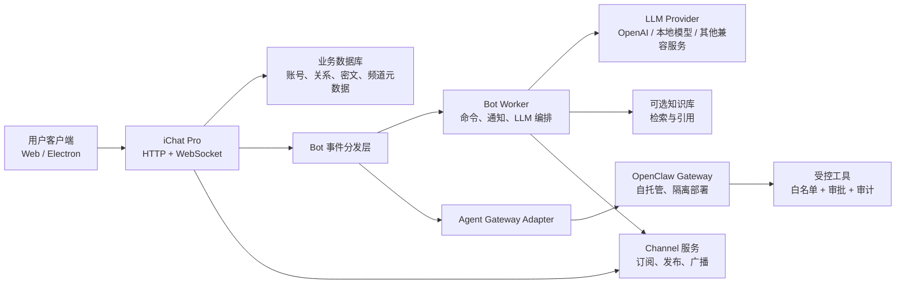
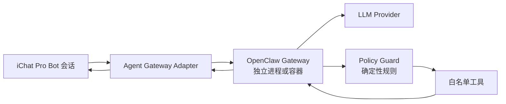

# iChat Pro Bot、LLM Agent 与 Channel 扩展方案文档

> 状态：Draft v1.0
> 适用范围：二期扩展设计
> 前置条件：完成当前仍开放的 T16 真实聊天数据接入、群聊模型统一和基础联调
> 核心原则：先引入受控 Bot，再接入 LLM，最后开放带工具调用能力的 Agent
> 阶段约束：本文档全部能力均属于 Phase 2。Phase 1 验收门槛详见 `docs/iChat Pro Phase 规划与一期交付审查文档.md`。

## 1. 文档目的

iChat Pro 一期聚焦端到端加密私聊、群聊、联系人和实时通信。二期可以在此基础上扩展：

1. 平台 Bot：支持命令、通知、自动回复和系统服务。
2. LLM Bot：支持问答、摘要、翻译和知识库检索。
3. Agent Bot：支持 OpenClaw 等自托管 Agent Gateway，在明确授权下执行工具调用。
4. Channel：支持一对多广播、订阅、公告和 Bot 自动发布。

这些能力不能简单复用普通端到端加密会话。Bot 或 Agent 如果要理解消息内容，必须在某个受信客户端或受控 Gateway 中获得明文。Channel 也更接近广播和内容分发，不应默认宣称具备与私聊相同的端到端加密保证。

本方案的目标是建立清晰的产品边界、数据模型、权限策略、接入协议和分阶段实施路径。

------

## 2. 范围与非目标

### 2.1 二期目标

| 能力 | 目标 |
| --- | --- |
| Bot 身份 | 在联系人、会话和消息中明确展示机器人身份 |
| 命令 Bot | 支持 `/help`、`/status` 等确定性命令 |
| LLM Bot | 支持受控对话、摘要、翻译和知识库问答 |
| Agent Bot | 支持接入 OpenClaw 等外部 Agent Gateway |
| Channel | 支持公开或私有频道、订阅、管理员发布和 Bot 发布 |
| 安全治理 | 支持授权、审计、限流、预算和人工确认 |

### 2.2 暂不纳入

1. 不允许 Bot 默认读取用户的全部聊天历史。
2. 不允许 Agent 默认拥有 Shell、文件系统、邮箱或浏览器控制权限。
3. 不把 Channel 宣称为默认端到端加密通信。
4. 不在一期直接实现开放式 Bot 商店。
5. 不允许第三方 Bot 未经审核自行安装任意技能。
6. 不要求首版支持多 Agent 自治协作。

------

## 3. 概念分层

Bot、LLM、Agent、OpenClaw 和 Channel 属于不同层次，不能混为一谈。

| 名称 | 定位 | 是否必须使用 LLM | 是否可以执行外部动作 |
| --- | --- | --- | --- |
| Bot | 以机器人身份参与会话或发布内容 | 否 | 可选 |
| 命令 Bot | 根据固定规则处理命令 | 否 | 通常受限 |
| LLM Bot | 将消息发送给模型并返回生成结果 | 是 | 默认否 |
| Agent Bot | 在模型推理基础上调用工具完成任务 | 通常是 | 是 |
| OpenClaw | 自托管 Agent Gateway，负责会话、记忆、工具和多渠道路由 | 是 | 是 |
| Channel | 一对多广播和订阅载体 | 否 | 可由 Bot 发布 |

推荐演进顺序：

```text
命令 Bot
→ 只读 LLM Bot
→ 带知识库检索的 LLM Bot
→ 受限工具 Agent
→ OpenClaw 等外部 Agent Gateway
→ 审核后的第三方 Bot 生态
```

------

## 4. 总体架构

### 4.1 推荐架构



### 4.2 职责边界

| 模块 | 职责 |
| --- | --- |
| iChat Pro Web / Electron | 展示 Bot 身份、发起授权、发送消息、展示结果 |
| Django API | 管理 Bot、Channel、权限、订阅、消息元数据和审计记录 |
| WebSocket | 推送 Bot 回复、Channel 新消息和任务状态 |
| Bot Worker | 异步处理命令、调用 LLM、生成回复 |
| Agent Gateway Adapter | 将 iChat Pro 事件转换为 OpenClaw 等 Agent Gateway 请求 |
| OpenClaw Gateway | 管理 Agent 会话、记忆、技能、工具调用和结果 |
| 工具策略层 | 执行确定性权限检查、预算限制和人工确认 |

### 4.3 为什么需要异步 Worker

LLM 和 Agent 响应时间明显长于普通消息发送。HTTP 请求或 WebSocket Consumer 不应直接阻塞等待模型输出。

推荐流程：

```text
收到用户消息
→ 保存任务
→ 返回 accepted 状态
→ Worker 异步调用模型或 Agent
→ 保存 Bot 回复或任务结果
→ WebSocket 推送给用户
```

开发阶段可以使用轻量后台任务；正式部署建议使用：

```text
Redis + Celery
```

或等价的可靠任务队列。

------

## 5. Bot 产品模型

### 5.1 Bot 类型

| 类型 | 示例 | 默认权限 |
| --- | --- | --- |
| `system` | 安全提醒、欢迎消息 | 仅发送平台通知 |
| `command` | `/help`、`/status` | 固定命令白名单 |
| `llm` | 问答、翻译、摘要 | 只处理用户主动发送的内容 |
| `agent` | OpenClaw 助手 | 受限工具调用，需要授权 |

Bot 类型按实现方式和能力层级划分。发布 Channel 内容属于授权角色，不属于独立 Bot 类型。一个 `command`、`llm` 或 `agent` Bot 都可能同时拥有：

```text
channel.draft
channel.publish
```

其中 `channel.publish` 属于高风险能力，默认不授予。

### 5.2 Bot 角色与能力

角色用于组合常见能力，能力用于执行时的最终鉴权。角色不是绕过能力检查的快捷方式。

| 角色 | 典型能力 | 说明 |
| --- | --- | --- |
| `channel_publisher` | `channel.draft`、可选 `channel.publish` | 为授权 Channel 生成草稿或发布内容 |
| `group_assistant` | `llm.chat`、可选 `conversation.summary` | 处理群聊中的显式提及 |
| `knowledge_assistant` | `llm.chat`、`knowledge.read` | 查询受控知识库 |
| `personal_agent` | 按用户授权组合 | 面向单一用户的私有 Agent |

### 5.3 Bot 身份展示

用户必须能明确区分真人和 Bot：

1. 头像旁显示 `BOT` 标识。
2. 资料页显示 Bot 类型、开发者、隐私说明和权限范围。
3. 每次 Agent 请求外部工具时显示状态。
4. 高风险动作必须展示确认按钮。
5. Bot 消息不得伪装为系统消息或真人消息。

### 5.4 交互方式

首版建议支持：

| 场景 | 方式 |
| --- | --- |
| 私聊 Bot | 用户主动打开 Bot 会话并发送消息 |
| 群聊 Bot | 用户通过 `@bot` 提及或 `/command` 显式调用 |
| Channel Bot | 管理员授权 Bot 发布内容 |
| Agent 任务 | 用户主动发起，并在必要时确认外部动作 |

群聊中不要让 LLM Bot 默认读取全部消息。推荐只处理：

1. 明确 `@bot` 提及的消息。
2. 用户回复给 Bot 的上下文。
3. 管理员明确授权的最近若干条上下文。

------

## 6. 端到端加密边界

### 6.1 普通私聊和群聊

现有 E2EE 规则保持不变：

```text
发送方客户端加密
→ 服务器只保存密文
→ 接收方客户端解密
```

服务器不能读取消息明文。

### 6.2 Bot 会话的三种模式

#### 模式 A：平台托管 Bot

平台 Worker 需要读取消息后调用 LLM，因此此类会话不能宣传为“服务器不可见明文”的普通 E2EE。

```text
用户客户端
→ TLS 传输
→ iChat Pro Bot Worker 获取明文
→ 调用 LLM
→ 返回结果
```

适合：

1. 公共问答 Bot。
2. 翻译 Bot。
3. Channel 内容生成 Bot。
4. 无敏感内容的演示能力。

界面必须显示：

```text
此 Bot 会话由服务端处理。消息可能发送给配置的 AI 服务，不属于端到端加密私聊。
```

#### 模式 B：Bot 作为 E2EE 会话成员

Bot 可以拥有独立客户端密钥，由专用 Bot Gateway 解密属于自己的密文副本。

```text
用户客户端 E2EE 加密
→ 服务器转发 Bot 专属密文
→ Bot Gateway 使用自己的私钥解密
→ 调用 LLM 或 Agent
→ Bot Gateway 加密回复
→ 用户客户端解密
```

此模式可以保持“服务器只保存密文”，但必须明确：

> Bot Gateway 是会话参与者。用户发给 Bot 的内容会在 Bot Gateway 中解密，并可能继续发送给外部 LLM Provider。

这不是“只有真人接收方能读”的私密会话，而是“包含 Bot 在内的会话成员可读”。

适合：

1. 自托管企业 Bot。
2. 用户自己的 OpenClaw Gateway。
3. 对服务器零明文存储有要求的场景。

##### 模式 B 的密钥生命周期

模式 B 必须复用现有逐成员 E2EE 设计，将 Bot Gateway 视为具有独立身份密钥的会话参与者。

```text
Bot Gateway 首次注册
→ 在 Gateway 内生成 ECDH P-256 密钥对
→ 私钥仅保存在 Bot Gateway 的受保护 Secret 存储中
→ 将公钥、指纹、算法和 key_version 上传 iChat Pro
→ iChat Pro 将 Bot 公钥作为公开身份信息提供给会话成员
```

推荐新增：

```text
BotPublicKey
  id
  bot_id
  identity_public_key
  key_fingerprint
  algorithm
  key_version
  is_active
  created_at
  updated_at
```

约束与普通用户公钥一致：

1. 私钥不得上传 iChat Pro。
2. 每个 Bot 仅有一个活动公钥版本。
3. 历史公钥版本保留，以便解密历史消息。
4. Bot Gateway 私钥必须通过 Secret 管理或受控文件权限保存，不写入日志、Prompt 或普通数据库字段。

##### 模式 B 的成员加入流程

群聊管理员邀请 Bot 后，服务端必须更新会话成员关系和 `membership_version`：

```text
管理员邀请 Bot
→ 校验管理员权限与 Bot 可用状态
→ 将 Bot 加入 ConversationMember
→ 更新 membership_version
→ 推送 conversation.membership.changed
→ 真人客户端重新拉取有效成员列表和活动公钥
→ 发送后续群消息时，为 Bot 生成独立密文副本
```

发送方客户端获取成员公钥时，应将 `user` 与 `bot` 统一视为可加密接收者：

```json
{
  "recipient_type": "bot",
  "recipient_id": 8,
  "identity_public_key": "BASE64_SPKI",
  "key_fingerprint": "SHA256_HEX",
  "key_version": 3,
  "algorithm": "ECDH-P256"
}
```

客户端仍执行逐成员加密：

```text
真人成员 A → 使用 A 的公钥派生密钥 → 生成 A 的密文副本
真人成员 B → 使用 B 的公钥派生密钥 → 生成 B 的密文副本
Bot 成员   → 使用 Bot 的公钥派生密钥 → 生成 Bot 的密文副本
```

Bot Gateway 只会收到属于自己的密文副本，不应获得其他成员副本。

##### 模式 B 的密钥轮换

Bot 密钥轮换必须显式执行：

```text
Bot Gateway 生成新密钥对
→ 上传新公钥版本
→ 旧公钥版本变为 inactive，但继续保留
→ 更新 Bot identity_version
→ 推送 bot.identity_key.changed
→ 客户端重新拉取公钥并提示安全指纹变化
→ 新消息使用新版本加密
→ 历史消息按记录的 key_version 使用旧私钥解密
```

Bot Gateway 需要保留仍可能用于历史解密的旧私钥。删除旧私钥前必须明确告知：对应历史消息将无法恢复。

如果群聊成员列表或 Bot 公钥版本发生变化，客户端不得继续发送使用旧快照生成的群消息。服务端必须通过 `membership_version` 和接收者版本校验拒绝过期请求。

#### 模式 C：客户端本地 Agent

Electron 客户端直接调用本地模型或本机 OpenClaw Gateway：

```text
用户 Electron 客户端
→ 本地 OpenClaw / 本地 LLM
→ 本地生成回复或执行任务
```

适合：

1. 私人助理。
2. 本地知识库。
3. 对隐私要求较高的用户。

这是隐私边界最清晰的 Agent 模式，但需要用户本机安装并维护 Gateway。

### 6.3 模式对比

| 维度 | 平台托管 Bot | Bot 作为 E2EE 成员 | 客户端本地 Agent |
| --- | --- | --- | --- |
| 接入成本 | 低 | 中 | 高 |
| 服务器能否看到明文 | 能 | 不能 |
| Bot Gateway 能否看到明文 | 能 | 能 | 本机可见 |
| 是否可调用云端 LLM | 可以 | 可以 | 可以 |
| 是否适合课程演示 | 最适合 | 可作为增强版 | 可作为展示方向 |
| 是否需要额外密钥管理 | 否 | 是 | 是 |

一期之后建议先实现模式 A，再实现模式 B。模式 C 可以随着 Electron 封装加入实验性支持。

------

## 7. LLM 接入设计

### 7.1 Provider 抽象

不要将业务代码绑定到某一家模型服务。定义统一接口：

```python
class LlmProvider:
    def complete(self, *, messages, model, temperature, max_tokens):
        ...

    def stream(self, *, messages, model, temperature, max_tokens):
        ...
```

推荐支持：

| Provider 类型 | 用途 |
| --- | --- |
| 云端 API | 快速获得较好的对话和推理能力 |
| OpenAI-compatible API | 兼容多种云端或自托管服务 |
| Ollama / 本地模型 | 本地演示和隐私敏感场景 |
| Mock Provider | 自动化测试，不产生外部费用 |

### 7.2 LLM Bot 能力边界

首版 LLM Bot 只提供低风险能力：

1. 普通问答。
2. 消息翻译。
3. 用户主动提交文本的摘要。
4. Channel 草稿生成。
5. FAQ 或知识库检索。

暂不默认开放：

1. 自动读取整个群聊历史。
2. 自动代表用户发送消息。
3. 自动修改账号、联系人或群成员。
4. 自动执行 Shell、文件系统或网络动作。

### 7.3 流式回复

模型流式输出可以通过 WebSocket 推送：

```json
{
  "event": "bot.response.delta",
  "data": {
    "task_id": "task_123",
    "bot_id": 8,
    "delta": "正在整理",
    "sequence": 3
  }
}
```

结束时发送：

```json
{
  "event": "bot.response.completed",
  "data": {
    "task_id": "task_123",
    "message_id": 901,
    "usage": {
      "input_tokens": 450,
      "output_tokens": 120
    }
  }
}
```

为避免数据模型复杂化，首版也可以只展示“生成中”状态，完成后一次性推送完整回复。

------

## 8. OpenClaw Agent 接入

### 8.1 OpenClaw 的定位

OpenClaw 是一个自托管 Agent Gateway。它不是 LLM 模型本身，而是位于聊天入口和模型之间的编排层，负责：

1. 接收不同 Channel 或聊天入口的消息。
2. 管理 Agent 会话和记忆。
3. 调用配置的 LLM。
4. 执行技能和工具。
5. 将结果路由回原始会话。

对于 iChat Pro，OpenClaw 不应直接嵌入 Django Web 进程。推荐通过独立服务和 Adapter 接入。

OpenClaw 官方安全文档明确采用“单一可信操作者边界”的个人助理模型：一个共享 Gateway 并不是面向多个互不信任用户的强隔离边界。iChat Pro 接入时必须遵守：

1. 不允许所有平台用户直接共享一个拥有高权限工具的 OpenClaw Gateway。
2. 私人 Agent 按用户或信任边界部署独立 Gateway、凭据和工作目录。
3. 团队共享 Agent 仅适用于同一信任边界，并限制为团队业务能力。
4. 互不信任用户之间需要拆分 Gateway，优先使用独立 OS 用户、容器或主机。
5. OpenClaw Session ID 只用于路由上下文，不作为 iChat Pro 权限凭证。

### 8.2 推荐拓扑



### 8.3 Adapter 职责

Adapter 应完成：

1. 将 iChat Pro 用户和会话映射为 OpenClaw Session。
2. 只转发明确授权的消息文本和附件。
3. 将 Agent 回复转换为 Bot 消息。
4. 将工具确认请求转换为 iChat Pro 交互卡片。
5. 记录任务、调用、错误和审计信息。
6. 隐藏 OpenClaw 内部凭据和配置。

### 8.4 接入协议

建议定义内部 HTTP API：

```text
POST /internal/agents/{agent_id}/messages
POST /internal/agents/{agent_id}/approvals/{approval_id}
GET  /internal/agents/{agent_id}/tasks/{task_id}
```

请求示例：

```json
{
  "task_id": "task_123",
  "session_id": "ichat:single:42:user:7",
  "user_id": 7,
  "conversation_id": 42,
  "message_id": 901,
  "content": "帮我总结这段文本",
  "attachments": [],
  "granted_capabilities": [
    "llm.chat",
    "knowledge.read"
  ]
}
```

OpenClaw 返回：

```json
{
  "task_id": "task_123",
  "status": "completed",
  "reply": "总结如下……",
  "citations": [],
  "tool_calls": []
}
```

### 8.5 工具调用安全

Agent 工具调用不能只依赖 Prompt 约束。必须使用确定性规则：

| 动作级别 | 示例 | 策略 |
| --- | --- | --- |
| `read` | 读取知识库、查看天气 | 可按授权自动执行 |
| `draft` | 生成草稿、生成待办 | 可自动执行，但只保存草稿 |
| `write` | 修改文件、创建日程 | 每次确认或按细粒度授权 |
| `send` | 发送邮件、发布 Channel 消息 | 必须人工确认 |
| `execute` | Shell、脚本、浏览器自动操作 | 默认禁用；仅隔离环境开放 |
| `admin` | 修改权限、删除数据、邀请成员 | 禁止 Agent 直接执行 |

推荐策略：

```text
默认拒绝
→ 按 Agent 配置能力白名单
→ 按用户授权范围检查
→ 高风险动作要求人工确认
→ 全量写入审计日志
```

### 8.6 隔离要求

OpenClaw Gateway 应：

1. 独立进程或容器运行。
2. 使用最小权限账号。
3. 默认禁止访问宿主机完整文件系统。
4. 默认禁止 Shell。
5. 默认禁止任意网络访问。
6. 凭据通过环境变量或 Secret 管理，不进入聊天上下文。
7. 每个 Agent 使用独立工作目录和工具白名单。
8. 对技能安装进行审核和固定版本管理。

------

## 9. Channel 产品设计

### 9.1 Channel 定位

Channel 是一对多广播载体，适合：

1. 公告。
2. 项目动态。
3. 知识内容发布。
4. Bot 自动推送。
5. 只读订阅。

它与群聊不同：

| 维度 | 群聊 | Channel |
| --- | --- | --- |
| 主要目的 | 多人讨论 | 广播发布 |
| 发言权限 | 成员通常可发言 | 仅管理员或授权 Bot 发布 |
| 成员关系 | 活跃成员 | 订阅者 |
| 消息规模 | 中小规模互动 | 可扩展为大量订阅者 |
| 默认加密 | 可使用逐成员 E2EE | 不建议默认逐订阅者 E2EE |

### 9.2 Channel 类型

| 类型 | 可见性 | 加入方式 |
| --- | --- | --- |
| `public` | 可搜索 | 直接订阅 |
| `private` | 不公开搜索 | 邀请链接或管理员批准 |
| `internal` | 组织内部 | 按成员关系授权 |

### 9.3 Channel 加密策略

Channel 不建议沿用群聊“为每位成员生成独立密文副本”的基础方案。订阅人数增加后，发送成本和存储成本会线性增长。

推荐分层：

| 场景 | 策略 |
| --- | --- |
| 公开 Channel | 服务端可读内容，使用 HTTPS / WSS 传输保护 |
| 私有 Channel 首版 | 服务端鉴权 + 服务端可读内容 |
| 高安全私有 Channel | 后续单独设计 Sender Key、内容密钥轮换和成员密钥分发 |

界面必须清楚显示：

```text
频道内容属于广播消息，不等同于端到端加密私聊。
```

### 9.4 Channel 与 Bot

Channel 允许：

1. 管理员手动发布。
2. 授权 Bot 发布。
3. LLM 生成草稿，管理员审核后发布。
4. Agent 拉取外部信息并生成待发布草稿。

首版禁止 Agent 自动发布。推荐流程：

```text
Agent 生成草稿
→ 管理员预览
→ 管理员确认
→ 发布到 Channel
```

------

## 10. 数据模型建议

### 10.1 Bot

```text
BotProfile
  id
  owner_id
  username
  display_name
  description
  bot_type
  status
  privacy_mode
  provider_type
  created_at
  updated_at
```

字段约束：

| 字段 | 可选值 | 说明 |
| --- | --- | --- |
| `bot_type` | `system`、`command`、`llm`、`agent` | 按实现方式和能力层级分类 |
| `status` | `active`、`disabled`、`revoked` | 是否允许新建任务和接收消息 |
| `privacy_mode` | `hosted`、`e2ee_member`、`local_agent` | 分别对应 6.2 节模式 A、B、C |
| `provider_type` | `none`、`openai_compatible`、`ollama`、`openclaw`、`custom` | Bot 的推理或 Agent 后端 |

`privacy_mode` 必须展示给用户，并决定消息路由方式。服务端不能将 `e2ee_member` 会话静默降级为 `hosted`。

```text
BotCapability
  id
  bot_id
  capability
  risk_level
  requires_confirmation
  created_at
```

```text
BotRole
  id
  bot_id
  role
  scope_type
  scope_id
  created_at
```

其中 `role` 可选值包括：

```text
channel_publisher
group_assistant
knowledge_assistant
personal_agent
```

模式 B 还需要：

```text
BotPublicKey
  id
  bot_id
  identity_public_key
  key_fingerprint
  algorithm
  key_version
  is_active
  created_at
  updated_at
```

### 10.2 Bot 任务和审计

```text
BotTask
  id
  bot_id
  requested_by_id
  conversation_id
  source_message_id
  status
  provider
  model
  input_token_count
  output_token_count
  error_code
  created_at
  completed_at
```

```text
AgentToolCall
  id
  task_id
  tool_name
  risk_level
  arguments_redacted
  status
  requires_confirmation
  confirmed_by_id
  created_at
  completed_at
```

```text
AgentAuditLog
  id
  actor_type
  actor_id
  action
  target_type
  target_id
  metadata_redacted
  created_at
```

字段约束：

| 字段 | 可选值或规则 |
| --- | --- |
| `actor_type` | `user`、`bot`、`agent`、`system` |
| `target_type` | 使用受控枚举，例如 `bot_task`、`tool_call`、`channel_draft`、`channel_message` |
| `metadata_redacted` | 仅保存结构化、脱敏后的 JSON，不保存原始 Prompt、完整消息或凭据 |

`metadata_redacted` 的脱敏规则：

1. API Key、Token、Cookie、Authorization Header、私钥和 Session Key 一律替换为 `[REDACTED]`。
2. 工具参数默认只保存字段名、类型、结果状态和必要资源标识。
3. 文件路径仅保存工作区相对路径；工作区外路径记录为 `[OUTSIDE_WORKSPACE]`。
4. URL 默认移除查询参数和片段；如需保留域名，保存规范化后的 `scheme + host + port`。
5. 用户消息默认不保存全文；排障所需摘要必须限制长度并经过敏感信息过滤。
6. 脱敏失败时拒绝写入详细元数据，仅记录事件类型和错误码。

日志中不得保存：

1. 用户私钥。
2. Session Key。
3. LLM Provider API Key。
4. 完整敏感消息明文。
5. 未脱敏的工具凭据。

### 10.3 Channel

```text
Channel
  id
  owner_id
  name
  slug
  description
  visibility
  status
  subscriber_count
  created_at
  updated_at
```

```text
ChannelMember
  id
  channel_id
  user_id
  role
  status
  subscribed_at
  muted_at
```

```text
ChannelMessage
  id
  channel_id
  sender_user_id
  sender_bot_id
  content
  message_type
  status
  published_at
  edited_at
```

`ChannelMessage` 必须增加数据库 Check Constraint：

```text
恰好一个发送者非空：
(sender_user_id IS NOT NULL AND sender_bot_id IS NULL)
OR
(sender_user_id IS NULL AND sender_bot_id IS NOT NULL)
```

如果未来增加 `system` 发布者，应使用显式 `sender_type` 扩展模型，不允许依赖两个字段同时为空表达系统消息。

```text
ChannelPublishDraft
  id
  channel_id
  generated_by_bot_id
  requested_by_id
  content
  status
  reviewed_by_id
  created_at
  published_at
```

公开和普通私有 Channel 可以保存服务端可读内容。若未来实现高安全 Channel，应单独增加密文表和密钥版本字段，不与普通 Channel 混用。

------

## 11. API 设计建议

### 11.1 Bot API

```text
GET    /api/bots/
GET    /api/bots/{bot_id}/
POST   /api/bots/
PATCH  /api/bots/{bot_id}/
POST   /api/bots/{bot_id}/disable/
GET    /api/bots/{bot_id}/capabilities/
POST   /api/bots/{bot_id}/capabilities/
PATCH  /api/bots/{bot_id}/capabilities/{capability_id}/
DELETE /api/bots/{bot_id}/capabilities/{capability_id}/
POST   /api/bots/{bot_id}/start-chat/
POST   /api/bots/{bot_id}/messages/
GET    /api/bots/{bot_id}/authorization/
POST   /api/bots/{bot_id}/authorization/
DELETE /api/bots/{bot_id}/authorization/
GET    /api/bots/tasks/{task_id}/
POST   /api/bots/tasks/{task_id}/cancel/
GET    /api/bots/tool-calls/pending/
POST   /api/bots/tool-calls/{tool_call_id}/approve/
POST   /api/bots/tool-calls/{tool_call_id}/reject/
```

说明：

1. Bot 和 Capability 的管理端点仅允许 Bot Owner 或管理员调用。
2. 用户可以通过授权端点查看、授予和撤销 Bot 权限。
3. 用户撤销授权后，新的 Bot 任务必须被拒绝；已有高风险待审批任务一并失效。
4. 工具调用审批同时支持 WebSocket 推送审批卡片和 HTTP 拉取待审批列表。
5. 前端收到 `bot.tool.confirmation_required` 后展示审批卡片，用户点击后调用 `approve` 或 `reject` 端点。
6. 页面刷新或断线重连后，通过 `GET /api/bots/tool-calls/pending/` 恢复未处理审批项。

### 11.2 Channel API

```text
GET    /api/channels/
POST   /api/channels/
GET    /api/channels/{channel_id}/
POST   /api/channels/{channel_id}/subscribe/
POST   /api/channels/{channel_id}/unsubscribe/
GET    /api/channels/{channel_id}/messages/
POST   /api/channels/{channel_id}/drafts/
POST   /api/channels/{channel_id}/drafts/{draft_id}/publish/
```

### 11.3 WebSocket 事件

```text
bot.task.accepted
bot.task.status
bot.response.delta
bot.response.completed
bot.response.failed
bot.tool.confirmation_required
channel.message.new
channel.draft.created
channel.message.published
```

------

## 12. 权限与隐私设计

### 12.1 最小权限

每个 Bot 必须声明权限：

```text
llm.chat
knowledge.read
channel.draft
channel.publish
conversation.summary
tool.calendar.read
tool.calendar.write
tool.files.read
tool.shell.execute
```

默认仅开放：

```text
llm.chat
```

### 12.2 用户授权

用户首次使用 LLM Bot 时，应展示：

1. Bot 会收到哪些文本。
2. 是否调用外部 LLM Provider。
3. 是否保存上下文。
4. 是否使用长期记忆。
5. 是否允许工具调用。
6. 如何撤销授权。

### 12.3 Prompt Injection 防护

LLM 和 Agent 必须将聊天内容视为不可信输入。防护措施：

1. 工具调用必须经过独立策略层校验。
2. 不将系统凭据写入 Prompt。
3. 检索内容不得覆盖系统策略。
4. 高风险动作必须人工确认。
5. 工具参数必须进行 schema 校验。
6. Agent 输出不得直接拼接到 Shell。
7. 外部网页、附件、URL、二维码、引用消息和 Channel 内容均按不可信数据处理。
8. Bot 不得自动抓取消息中的 URL；抓取前应经过用户确认或能力授权。
9. URL 抓取器必须限制协议、重定向次数、响应大小、超时和内容类型。
10. URL 抓取器必须阻止访问环回地址、私网地址、云元数据地址和内部管理端点，防止 SSRF。
11. 抓取到的网页内容只作为不可信参考资料，不得提升为系统指令。

------

## 13. 分阶段实施路线

### 阶段 0：前置收敛

截至 2026 年 6 月 3 日，T15 群聊逐成员加密已经合并；T16 真实聊天数据接入仍为开放 Issue。二期开发开始前，应核验并完成：

1. T16 真实聊天数据接入。
2. T22 群聊领域模型统一。
3. T23 旧群组页面权限修复。
4. T24 旧版前端 E2EE 和 WebSocket 脚本清理。
5. T20 基础安全联调中与 Bot 接入相关的验证项。

### 阶段 1：Channel 与命令 Bot

1. 新增 Channel、订阅和发布模型。
2. 新增 BotProfile 和 BotCapability。
3. 实现 `/help`、`/status` 等命令 Bot。
4. 支持管理员授权 Bot 发布 Channel 草稿。
5. 增加权限测试和审计日志。

### 阶段 2：只读 LLM Bot

1. 增加 Provider 抽象和 Mock Provider。
2. 增加异步 Worker。
3. 实现问答、翻译和摘要。
4. 增加 Token 预算、速率限制和超时。
5. 明确展示隐私提示。

### 阶段 3：OpenClaw Adapter

1. 将 OpenClaw Gateway 作为独立服务部署。
2. 实现 Session 映射和 Adapter API。
3. 首批仅开放只读工具。
4. 实现人工确认流程。
5. 增加审计、取消、超时和失败重试。

### 阶段 4：受限 Agent 与高安全扩展

1. 按需开放草稿、写入和发送能力。
2. 引入更严格的沙箱隔离。
3. 设计高安全私有 Channel 的 Sender Key 方案。
4. 评估用户本地 Electron + OpenClaw 模式。

------

## 14. 建议新增 Issue

建议将二期拆成独立 Issue：

| 编号建议 | 标题 |
| --- | --- |
| T33 | Design and implement Channel models and subscription APIs |
| T34 | Add Bot identities, capabilities, and audit logs |
| T35 | Implement command Bot workflow and Channel draft publishing |
| T36 | Add provider-agnostic LLM Bot integration |
| T37 | Add asynchronous Bot task processing and WebSocket status events |
| T38 | Implement OpenClaw Agent Gateway adapter |
| T39 | Add Agent tool approval, sandbox, and policy guard |
| T40 | Evaluate local Electron Agent and encrypted Bot-member mode |

------

## 15. 验收标准

### 15.1 Channel

1. 用户可以订阅和取消订阅 Channel。
2. 只有管理员和授权 Bot 可以创建待发布内容。
3. Agent 生成的内容默认进入草稿，不自动公开发布。
4. UI 明确区分 Channel 广播与 E2EE 私聊。

### 15.2 Bot

1. 用户能明确识别 Bot 身份。
2. Bot 只能处理被显式发送或授权的内容。
3. LLM Provider 可以替换，不绑定单一厂商。
4. 失败、超时、限流和预算耗尽都有明确状态。

### 15.3 Agent

1. OpenClaw 独立部署，不运行在 Django Web 进程中。
2. 工具调用经过确定性策略校验。
3. 高风险动作必须人工确认。
4. 所有工具调用都有脱敏审计记录。
5. 默认禁止 Shell、任意文件系统和任意网络访问。

### 15.4 安全边界

1. 普通 E2EE 私聊和群聊保持原有安全模型。
2. Bot 会话显式说明明文可见范围。
3. Channel 不错误宣称具备普通私聊同等级 E2EE。
4. 日志和数据库中不保存私钥、Session Key 或 Provider API Key。

------

## 16. 推荐决策

对于 iChat Pro，推荐采用以下产品路线：

1. 一期继续完成真实聊天闭环，不同时引入 Bot 和 Channel。
2. 二期先实现 Channel 和命令 Bot，验证权限模型。
3. LLM Bot 首版使用平台托管模式，能力限制为问答、摘要、翻译和草稿生成。
4. OpenClaw 作为可选外部 Agent Gateway，通过 Adapter 接入，不与 Django 服务混合部署。
5. Agent 首批只开放只读工具，高风险动作始终要求人工确认。
6. 对隐私要求较高的场景，再增加“Bot 作为 E2EE 成员”和“Electron 本地 Agent”模式。

------

## 17. 参考资料

1. OpenClaw 官方文档：

   ```text
   https://docs.openclaw.ai/
   ```

2. OpenClaw 官方 GitHub 仓库：

   ```text
   https://github.com/openclaw/openclaw
   ```

3. OpenClaw Getting Started：

   ```text
   https://docs.openclaw.ai/start/getting-started
   ```

4. OpenClaw Gateway Security：

   ```text
   https://docs.openclaw.ai/gateway/security
   ```

5. OpenClaw Gateway Architecture：

   ```text
   https://docs.openclaw.ai/concepts/architecture
   ```

6. iChat Pro 端到端加密通信设计：

   ```text
   docs/iChat Pro 端到端加密通信设计文档.md
   ```

7. iChat Pro 实时通信与端到端加密消息协议设计：

   ```text
   docs/iChat Pro 实时通信与端到端加密消息协议设计文档.md
   ```
