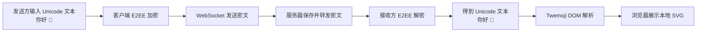

# iChat Pro Twemoji 表情渲染方案文档

> 状态：Draft v1.0
> 适用范围：Web 前端、Electron 桌面端、T16 真实聊天数据接入
> 推荐实现：自托管固定版本的 Twemoji SVG 素材

## 1. 文档目的

Windows 系统自带 Emoji 的视觉风格、彩色图形支持和国旗显示效果与 macOS、Android 等平台存在差异。iChat Pro 如果直接依赖操作系统字体渲染 Emoji，不同用户看到的聊天界面会不一致，Electron 桌面端也无法稳定保持统一风格。

本方案引入维护中的 `jdecked/twemoji`，将消息文本中的 Unicode Emoji 渲染为项目本地托管的 SVG 图片，使 Web 页面和 Electron 桌面端获得一致、清晰的表情显示效果。

Twemoji 只属于前端展示层。它不改变消息文本格式，不参与端到端加密算法，也不会降低现有端到端加密能力。

------

## 2. 设计结论

一期采用以下方案：

| 项目 | 结论 |
| --- | --- |
| Emoji 数据格式 | 使用标准 Unicode 字符，例如 `👋`、`😂`、`❤️` |
| 消息存储 | 不单独存储 Emoji 图片、HTML 或 SVG 地址 |
| 加密对象 | 加密包含 Emoji 的原始 Unicode 文本 |
| 渲染方式 | 接收方解密得到文本后，在浏览器 DOM 中转换为 Twemoji SVG |
| 素材来源 | 使用维护中的 `jdecked/twemoji` |
| 部署方式 | 下载固定版本并自托管，不在生产环境依赖第三方 CDN |
| 图片格式 | SVG |
| 许可证 | 代码为 MIT；图形素材为 CC-BY 4.0，需要保留署名 |

------

## 3. 与端到端加密的关系

### 3.1 核心原则

Emoji 是文本内容的一部分。用户发送 `你好 👋` 时，输入框中的内容仍然是 Unicode 文本，不是图片，也不是 HTML。

端到端加密模块加密完整文本：

```text
plaintext = "你好 👋"
```

发送方浏览器执行：

```text
"你好 👋"
→ UTF-8 编码
→ AES-GCM 加密
→ ciphertext + nonce + auth_tag
→ WebSocket 发送密文
```

接收方浏览器执行：

```text
ciphertext + nonce + auth_tag
→ AES-GCM 解密
→ UTF-8 解码
→ "你好 👋"
→ Twemoji DOM 渲染
→ "你好 " + 
```

服务器仍然只接触密文，不知道消息中是否包含 Emoji。

### 3.2 数据流



### 3.3 不应采用的方式

以下方式禁止使用：

1. 不将 `` 标签作为消息内容加密或保存。
2. 不在数据库中保存 Emoji 的 SVG 地址。
3. 不在 WebSocket 数据包中新增不必要的 `emoji_url` 或 `emoji_html` 字段。
4. 不使用 `innerHTML` 直接渲染用户发送或解密得到的文本。
5. 不依赖 Windows 系统 Emoji 字体作为最终展示效果。

保持 Unicode 文本作为唯一数据源，可以确保消息复制、粘贴、跨平台传输、历史记录加载和端到端加密逻辑保持简单可靠。

------

## 4. 技术选型

### 4.1 推荐使用 `jdecked/twemoji`

项目地址：

```text
https://github.com/jdecked/twemoji
```

该项目是 Twemoji 的维护分支，提供 JavaScript 解析器、SVG 素材和 PNG 素材。项目应选择一个明确的固定版本，例如 `17.0.2`，测试后再升级，不使用浮动的 `latest` 地址。

### 4.2 使用 SVG 的原因

| 对比项 | SVG | PNG |
| --- | --- | --- |
| 清晰度 | 任意缩放保持清晰 | 放大后可能模糊 |
| 聊天气泡适配 | 适合不同字号 | 需要选择固定尺寸 |
| Electron 显示 | 清晰稳定 | 依赖图片尺寸 |
| 素材体积 | 单个文件通常较小 | 需要准备多种尺寸 |

因此，一期统一使用 SVG。

### 4.3 自托管的原因

生产环境不应直接从第三方 CDN 加载 Emoji 素材或 Twemoji 脚本，原因如下：

1. 避免第三方 CDN 故障导致聊天表情无法显示。
2. 避免第三方资源变化造成界面不一致。
3. 降低第三方脚本被篡改后的安全风险。
4. Electron 桌面端在离线或弱网环境下仍可显示 Emoji。
5. 便于后续配置 Content Security Policy。

------

## 5. 项目目录规划

建议新增以下目录：

```text
static/
  vendor/
    twemoji/
      LICENSE
      LICENSE-GRAPHICS
      twemoji.min.js
      assets/
        svg/
          1f44b.svg
          1f602.svg
          2764.svg
          ...
```

说明：

1. `twemoji.min.js` 为 Twemoji DOM 解析器。
2. `assets/svg/` 保存 Emoji SVG 素材。
3. `LICENSE` 和 `LICENSE-GRAPHICS` 随素材一起纳入仓库。
4. 可先引入常用 Emoji，后续再按需求补充完整素材集。
5. 若采用按需素材集，需要为未收录 Emoji 保留系统字体回退。

------

## 6. 前端接入方式

### 6.1 在聊天页面加载 Twemoji

在 Django 模板中通过 `` 引入本地脚本：

```html

<script src=""></script>
```

Twemoji 脚本应在聊天交互脚本之前加载。

### 6.2 封装统一渲染函数

在聊天前端脚本中提供统一入口：

```js
function renderTwemoji(container) {
  if (!container || !window.twemoji) return;

  window.twemoji.parse(container, {
    base: '/static/vendor/twemoji/assets/',
    folder: 'svg',
    ext: '.svg',
    className: 'chat-emoji',
  });
}
```

不要使用字符串拼接生成 Emoji ``。Twemoji 官方推荐 DOM 解析模式：它只替换文本节点中的 Emoji，不破坏周围 DOM 节点和事件监听器，也避免通过 `innerHTML` 渲染用户内容。

### 6.3 渲染解密后的消息

消息气泡应先使用 `textContent` 写入解密文本，再调用 Twemoji：

```js
function renderDecryptedMessage(messageElement, plaintext) {
  messageElement.textContent = plaintext;
  renderTwemoji(messageElement);
}
```

该顺序同时满足：

1. 防止消息内容被当作 HTML 执行。
2. 保留换行和普通文本。
3. 将 Emoji 稳定替换为本地 SVG。

### 6.4 渲染会话预览和选择器

除消息气泡外，以下区域也应调用同一个 `renderTwemoji()`：

| 区域 | 示例 |
| --- | --- |
| 会话列表预览 | `收到，谢谢 👍` |
| 回复引用 | `原消息：稍后见 👋` |
| 搜索结果摘要 | `部署完成 🎉` |
| Emoji 选择器 | `😀 😂 👍 ❤️` |
| 系统提示 | `🔒 已启用端到端加密` |

Emoji 选择器点击后，只向输入框插入 Unicode：

```js
messageInput.value += '👋';
```

输入框本身可以继续使用系统字体显示 Emoji。真正发送后，消息气泡会切换为统一的 Twemoji SVG。若后续希望输入框也完全统一，可再实现富文本输入层，但不纳入一期。

------

## 7. 样式规范

在聊天样式表中新增：

```css
.chat-emoji {
  width: 1.25em;
  height: 1.25em;
  margin: 0 0.08em;
  vertical-align: -0.2em;
  display: inline-block;
}

.emoji-picker .chat-emoji {
  width: 1.5rem;
  height: 1.5rem;
  margin: 0;
}
```

设计原则：

| 场景 | 建议尺寸 |
| --- | --- |
| 普通聊天文本 | `1.15em ~ 1.3em` |
| 会话列表预览 | `1em ~ 1.1em` |
| Emoji 选择器 | `1.4rem ~ 1.7rem` |
| 纯 Emoji 消息 | 后续可根据字符数量放大 |

一期不需要实现类似 Telegram 的超大纯 Emoji 消息，但样式设计应保留扩展空间。

------

## 8. 与现有代码的结合点

当前项目应在 T16 真实聊天数据接入时完成 Twemoji 集成。

| 文件 | 调整方向 |
| --- | --- |
| `templates/pages/chat.html` | 加载本地 `twemoji.min.js` |
| `static/js/chat.js` | 增加 `renderTwemoji()`，在消息气泡、会话预览和选择器渲染后调用 |
| `static/css/chat.css` | 增加 `.chat-emoji` 样式 |
| `static/vendor/twemoji/` | 新增固定版本脚本、SVG 素材和许可证文件 |
| `README.md` 或 About 页面 | 增加 Twemoji 图形素材署名 |

Twemoji 集成应与以下逻辑保持解耦：

1. `static/js/private-chat-e2ee.js` 只负责私聊加密和解密。
2. `static/js/group-chat-e2ee.js` 只负责群聊逐成员加密和解密。
3. Twemoji 只处理解密后的 DOM 展示。
4. Django 模型、历史记录接口和 WebSocket 协议不需要增加 Emoji 专用字段。

------

## 9. 安全注意事项

### 9.1 防止 XSS

解密后的消息仍然属于不可信用户输入。必须使用：

```js
messageElement.textContent = plaintext;
renderTwemoji(messageElement);
```

禁止使用：

```js
messageElement.innerHTML = plaintext;
```

Twemoji 的字符串解析模式不负责清理恶意 HTML，因此不用于聊天消息渲染。

### 9.2 防止第三方资源风险

1. 固定 Twemoji 版本。
2. 将脚本和 SVG 素材保存到项目本地。
3. 不使用 `@latest` CDN 地址。
4. 在升级素材版本前运行视觉回归测试。
5. 在生产环境配置 Content Security Policy 时，仅允许加载自身静态资源。

### 9.3 许可证要求

Twemoji 代码使用 MIT License，图形素材使用 CC-BY 4.0 License。

项目应在 README、About 页面或第三方许可证说明中加入类似文字：

```text
Emoji graphics are provided by Twemoji
(https://github.com/jdecked/twemoji)
and licensed under CC-BY 4.0.
```

------

## 10. 测试方案

### 10.1 功能测试

| 编号 | 测试内容 | 预期结果 |
| --- | --- | --- |
| E01 | 发送普通文本 | 文本正常显示，不生成 Emoji 图片 |
| E02 | 发送 `你好 👋` | 接收方解密成功，`👋` 显示为本地 SVG |
| E03 | 发送多个 Emoji | 顺序、肤色修饰符和组合 Emoji 正常显示 |
| E04 | 发送国旗 Emoji | Windows 与 Electron 中显示一致 |
| E05 | 从 Emoji 选择器插入表情 | 输入框插入 Unicode，发送后正常渲染 |
| E06 | 加载历史消息 | 解密后的 Emoji 正常渲染 |
| E07 | 会话列表最后一条消息包含 Emoji | 预览正常渲染 |
| E08 | 浏览器禁用 Twemoji 脚本 | Emoji 回退为系统字体，不影响消息文本 |

### 10.2 安全测试

| 编号 | 测试内容 | 预期结果 |
| --- | --- | --- |
| S01 | 发送 `` | 作为纯文本显示，不执行脚本 |
| S02 | 检查 WebSocket 数据包 | 仅包含密文和元数据，不包含 SVG 或 HTML |
| S03 | 检查数据库 | 不出现 Emoji 专用字段、HTML 或 SVG 地址 |
| S04 | 离线打开 Electron 客户端 | 本地 SVG 可以正常显示 |

### 10.3 跨平台测试

至少验证以下环境：

1. Windows 11 + Chrome。
2. Windows 11 + Edge。
3. Electron 桌面端。
4. macOS 或 Linux 浏览器，如团队环境允许。

------

## 11. 实施步骤

建议按以下顺序实施：

1. 下载并固定 `jdecked/twemoji` 版本。
2. 将解析器、SVG 素材和许可证加入 `static/vendor/twemoji/`。
3. 在聊天模板中加载本地 Twemoji 脚本。
4. 在 `chat.js` 中增加统一的 DOM 渲染函数。
5. 对消息气泡、历史消息、会话预览和 Emoji 选择器接入渲染函数。
6. 保持私聊和群聊 E2EE 模块不变，仅传输 Unicode 文本加密后的密文。
7. 补充 XSS、Emoji 组合和离线资源测试。
8. 在 README 或 About 页面增加素材署名。

------

## 12. 验收标准

满足以下条件后，可认为 Twemoji 方案完成：

1. Windows 浏览器与 Electron 桌面端不再依赖系统 Emoji 风格展示聊天消息。
2. 私聊和群聊消息仍以 Unicode 文本参与端到端加密。
3. 服务端数据库和 WebSocket 数据包中不出现 Emoji HTML、SVG 地址或消息明文。
4. Emoji SVG 素材全部从项目本地加载。
5. 解密消息使用 `textContent` 写入 DOM，不引入 XSS 风险。
6. 消息气泡、历史记录、会话预览和 Emoji 选择器显示风格一致。
7. 项目保留 Twemoji 图形素材的 CC-BY 4.0 署名。

------

## 13. 参考资料

1. Twemoji 维护分支：

   ```text
   https://github.com/jdecked/twemoji
   ```

2. Twemoji 图形素材许可证：

   ```text
   https://github.com/jdecked/twemoji/blob/main/LICENSE-GRAPHICS
   ```

3. iChat Pro 端到端加密通信设计：

   ```text
   docs/iChat Pro 端到端加密通信设计文档.md
   ```

4. iChat Pro 实时通信与端到端加密消息协议设计：

   ```text
   docs/iChat Pro 实时通信与端到端加密消息协议设计文档.md
   ```

