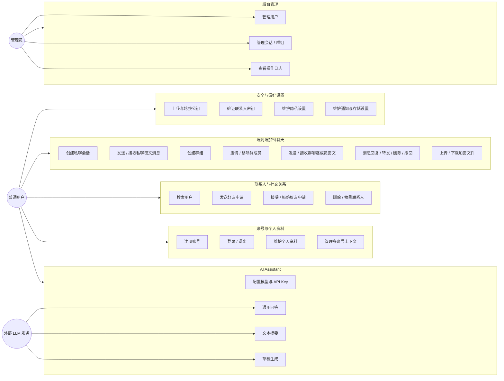
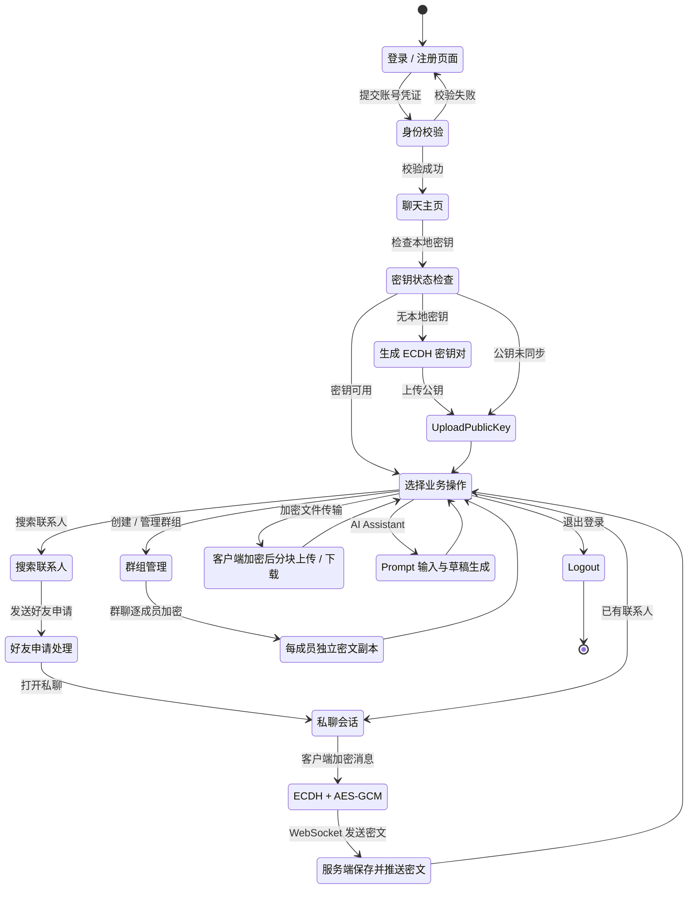
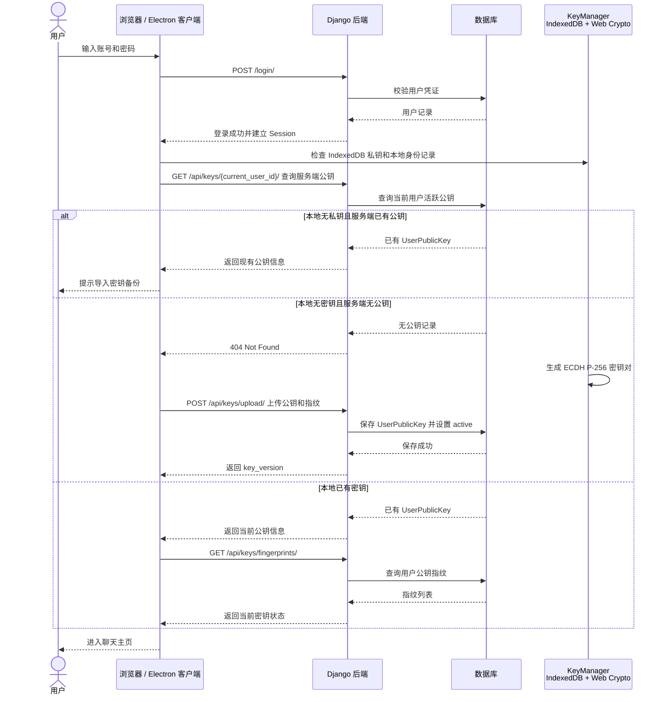
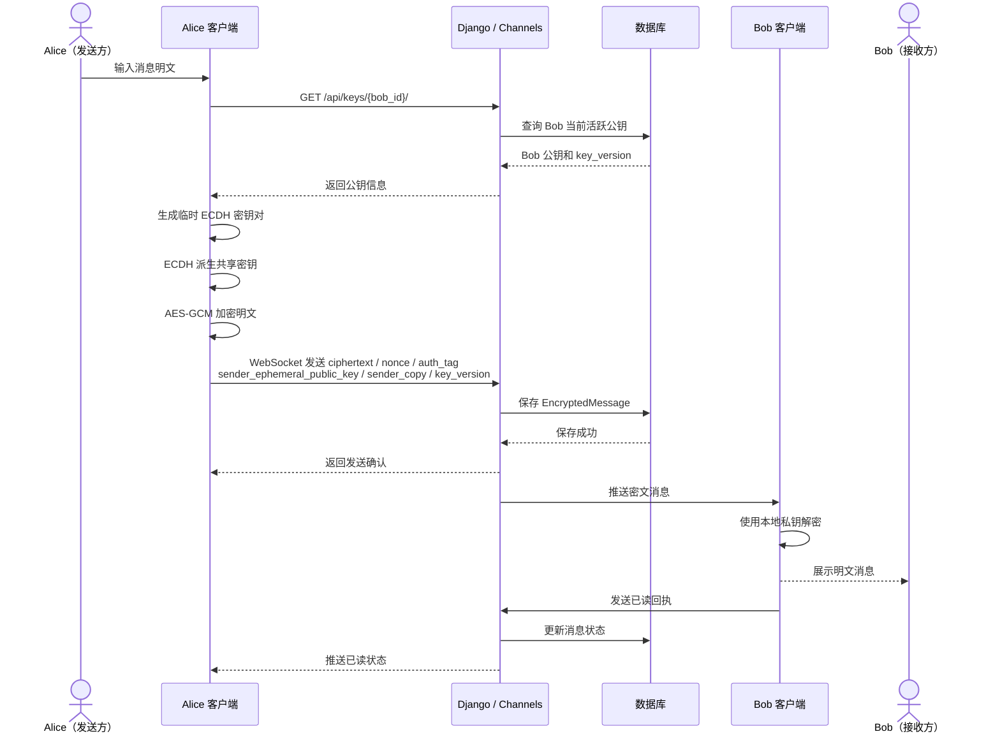
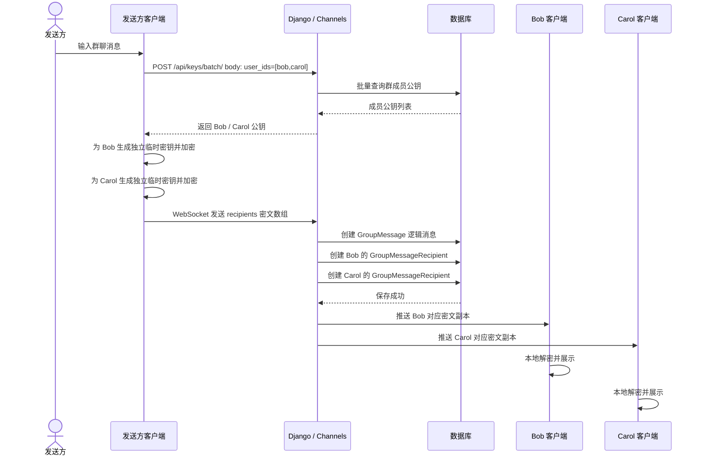
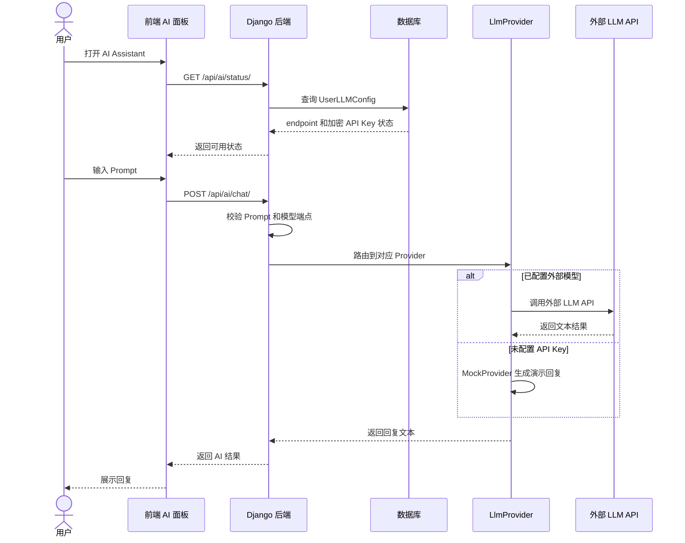
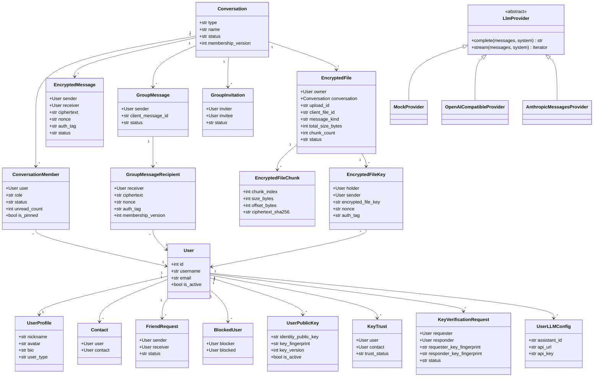
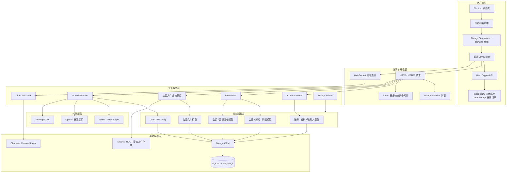
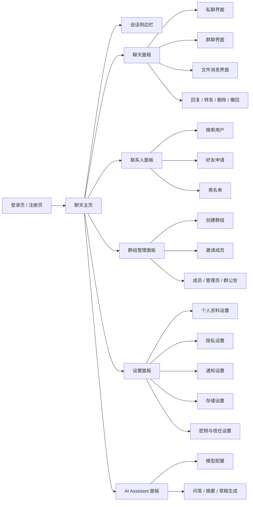

# iChat Pro UML 与架构图交付文档

> 版本：v3.0
> 日期：2026-06-25
> 作者：ketter1024
> 渲染引擎：Mermaid（推荐 VS Code Mermaid Preview 或 GitHub 原生渲染）

本文档按照软件工程大作业报告章节重新整理 iChat Pro 的需求分析图、类图、系统架构图、数据模型图和系统实现说明。图表均以 Mermaid 形式维护，便于后续同步到 Word、PPT 或在线文档。

> **AI Assistant 安全边界声明**：LLM/AI Assistant 组件不读取 E2EE 聊天明文，不持有或接触用户私钥、ECDH 会话密钥或 Key Encryption Key，仅处理用户主动输入的 Prompt 文本。

---

## 一、文档说明

本文档面向课程报告中的 UML 与系统设计章节，当前覆盖：

| 报告章节 | 本文档内容 |
|----------|------------|
| 二、用例图 | 项目用例图 + 简要用例介绍 |
| 三、用例说明文档 | 用例描述表格 + 活动图 |
| 四、需求分析时序图 | 登录、私聊、群聊、AI Assistant 时序图 + 简要说明 |
| 五、需求分析类图 | 核心类图 + 文字说明 |
| 六、系统架构 | 系统体系结构图 + 文字说明 |
| 七、数据模型 | 数据库 ER 图 + 文字说明 |
| 八、系统实现 | 界面截图占位 + 界面流程 Mermaid + 文字说明 |

---

## 二、用例图

### 2.1 项目用例图

### 2.2 简要用例介绍

iChat Pro 的主要参与者包括普通用户、管理员和外部 LLM 服务。普通用户完成账号注册、登录、资料维护、联系人管理、私聊、群聊、加密文件传输、密钥验证和 AI Assistant 使用；管理员通过 Django Admin 对用户、会话、群组及操作日志进行维护；外部 LLM 服务仅作为 AI Assistant 的文本生成服务提供方，不参与聊天消息解密和密钥协商。

| 用例编号 | 用例名称 | 参与者 | 简要说明 |
|----------|----------|--------|----------|
| UC01 | 注册账号 | 普通用户 | 用户填写用户名、邮箱和密码，系统创建账号并初始化个人资料。 |
| UC02 | 登录 / 退出 | 普通用户 | 用户通过用户名或邮箱登录系统，完成会话建立或退出。 |
| UC06 | 发送好友申请 | 普通用户 | 用户搜索目标用户并发送好友申请，等待对方处理。 |
| UC10 | 发送 / 接收私聊密文消息 | 普通用户 | 双方通过客户端 Web Crypto 完成 ECDH 协商和 AES-GCM 加密，服务端仅保存密文。 |
| UC13 | 发送 / 接收群聊逐成员密文 | 普通用户 | 发送方为每个群成员生成独立密文副本，服务端转发对应成员的密文。 |
| UC15 | 上传 / 下载加密文件 | 普通用户 | 文件在客户端加密后分块上传，服务端保存密文文件和分块元数据。 |
| UC17 | 验证联系人密钥 | 普通用户 | 用户查看密钥指纹并标记联系人密钥可信状态，降低中间人攻击风险。 |
| UC20 | 配置模型与 API Key | 普通用户 | 用户为 AI Assistant 配置模型端点和 API Key，API Key 加密存储；模型名称作为前端会话配置传入。 |
| UC24 | 管理用户 | 管理员 | 管理员在后台启用、停用或查看用户状态。 |
| UC26 | 查看操作日志 | 管理员 | 管理员审计关键后台操作。 |

---

## 三、用例说明文档

### 3.1 核心用例描述表格

| 项目 | 内容 |
|------|------|
| 用例名称 | 发送私聊端到端加密消息 |
| 主要参与者 | 普通用户（发送方、接收方） |
| 前置条件 | 双方已登录；双方已建立联系人关系；客户端已生成并上传 ECDH 公钥。 |
| 触发条件 | 发送方在私聊会话中输入消息并点击发送。 |
| 基本流程 | 1. 发送方打开私聊会话；2. 客户端拉取接收方公钥；3. 客户端生成临时 ECDH 密钥并派生会话密钥；4. 客户端使用 AES-GCM 加密明文；5. 客户端通过 WebSocket 发送密文；6. 服务端保存密文并推送给接收方；7. 接收方客户端本地解密并展示消息。 |
| 扩展流程 | 若公钥不存在或已失效，系统提示重新上传或刷新密钥；若 WebSocket 断开，前端提示重连或稍后重试。 |
| 后置条件 | 消息以密文形式存入数据库，接收方收到对应密文并在本地完成解密。 |
| 异常处理 | 非联系人、非会话成员、密文字段缺失、签名或认证标签异常时，系统拒绝发送或显示错误提示。 |
| 安全要求 | 服务端不存储明文，不接触用户私钥；每条消息使用 nonce 和认证标签保证机密性与完整性。 |

| 项目 | 内容 |
|------|------|
| 用例名称 | 创建群聊并发送群聊消息 |
| 主要参与者 | 普通用户（群主 / 管理员 / 群成员） |
| 前置条件 | 用户已登录；被邀请成员与发起者满足群邀请条件。 |
| 触发条件 | 用户创建群组或在群组中发送消息。 |
| 基本流程 | 1. 用户创建群组；2. 系统创建 Conversation 和 ConversationMember；3. 群主或管理员邀请成员；4. 用户输入群消息；5. 客户端批量获取群成员公钥；6. 客户端为每位成员生成独立密文副本；7. 服务端保存 GroupMessage 和 GroupMessageRecipient；8. 成员客户端收到属于自己的密文并解密展示。 |
| 扩展流程 | 普通成员邀请新成员时，可能需要管理员审批；成员变更后系统更新 membership_version。 |
| 后置条件 | 群消息逻辑记录和逐成员密文副本保存成功，当前有效成员收到对应消息。 |
| 异常处理 | 非群成员、已退出成员、重复邀请、无权限移除成员等操作会被拒绝。 |
| 安全要求 | 群聊采用逐成员加密，不向非成员或已退出成员暴露后续消息密文。 |

| 项目 | 内容 |
|------|------|
| 用例名称 | 使用 AI Assistant 生成回复草稿 |
| 主要参与者 | 普通用户、外部 LLM 服务 |
| 前置条件 | 用户已登录；AI Assistant 可使用 MockProvider 或已配置外部模型。 |
| 触发条件 | 用户打开 AI Assistant 面板并输入 Prompt。 |
| 基本流程 | 1. 前端加载 AI 配置状态；2. 用户输入 Prompt；3. 后端校验模型端点安全性；4. 后端选择 LlmProvider；5. LLM 返回文本结果；6. 前端展示结果；7. 用户可手动复制为聊天草稿。 |
| 扩展流程 | 未配置 API Key 时系统自动使用 MockProvider；外部服务失败时返回可理解的错误或降级响应。 |
| 后置条件 | AI 回复展示在前端面板中，只有用户主动复制或发送时才进入聊天输入框。 |
| 异常处理 | 非 HTTPS 端点、内网 IP、保留 IP、非法域名或超时响应会被拒绝。 |
| 安全要求 | AI Assistant 不读取聊天数据库明文，不接触 E2EE 私钥和会话密钥。 |

### 3.2 总体业务活动图

**说明：** 活动图从用户登录开始，覆盖密钥初始化、联系人关系建立、私聊 E2EE、群聊逐成员加密、文件传输和 AI Assistant。聊天消息和文件均在客户端完成加密，服务端只承担身份校验、密文保存、成员权限控制和消息转发。

---

## 四、需求分析时序图

### 4.1 用户登录与密钥初始化时序图

**说明：** 登录成功后，前端会检查 IndexedDB 中是否已有 ECDH 私钥，并通过本地身份记录确认公钥版本。若本地没有密钥且服务端也没有公钥，则调用 Web Crypto API 生成密钥对，仅上传公钥和指纹；若服务端已有公钥但本地私钥丢失，系统会提示用户导入密钥备份，避免生成新密钥覆盖旧密文的解密能力。

### 4.2 私聊 E2EE 消息发送时序图

**说明：** 私聊时序图体现了端到端加密的关键需求：明文只存在于发送方和接收方客户端，服务端保存和转发的都是密文字段。

### 4.3 群聊逐成员加密时序图

**说明：** 群聊采用“一个逻辑消息 + 多个逐成员密文副本”的方式实现。每个成员收到的 ciphertext 不同，成员变更通过 membership_version 控制可见范围。

### 4.4 AI Assistant 需求时序图

**说明：** AI Assistant 只处理用户主动输入的 Prompt。用户若需要把 AI 回复用于聊天，需要手动复制到聊天输入框，再进入正常 E2EE 加密发送流程。

---

## 五、需求分析类图

**说明：** 类图以 Django 模型和核心服务抽象为基础。`User` 是账号体系核心，向外关联资料、联系人、好友申请、公钥、密钥信任、密钥验证请求和 AI 配置。`Conversation` 统一表示私聊和群聊，通过 `ConversationMember` 维护成员关系。私聊消息保存在 `EncryptedMessage`，群聊通过 `GroupMessage` 和 `GroupMessageRecipient` 拆分逻辑消息与逐成员密文副本。文件传输由 `EncryptedFile`、`EncryptedFileChunk` 和 `EncryptedFileKey` 表示。AI Assistant 通过 `UserLLMConfig` 保存用户级 endpoint 和加密 API Key，模型名由前端会话配置传入；`LlmProvider` 抽象兼容 Mock、OpenAI 兼容接口和 Anthropic Messages API。

---

## 六、系统架构

### 6.1 系统体系结构图

### 6.2 架构说明

iChat Pro 采用 Django 单体 Web 应用 + Channels 实时通信架构。客户端包括浏览器页面和 Electron 桌面壳，主要界面由 Django Templates 和 Tailwind CSS 渲染，消息加解密由前端 JavaScript 调用 Web Crypto API 完成。本地私钥存放在 IndexedDB，LocalStorage 主要保存身份公钥记录、界面偏好和 AI 会话配置。访问与通信层同时支持 HTTP 接口和 WebSocket 实时推送，并通过 Session、CSRF、CSP 和 Origin 校验保障访问安全。

后端业务服务层分为账号、聊天、群组、文件传输、AI Assistant 和后台管理模块。领域模型层以 Django ORM 模型承载账号关系、会话消息、密钥信任、加密文件和 AI 配置。基础设施层可以使用 SQLite 进行课程演示，也可以迁移到 PostgreSQL；文件内容以密文形式存储在媒体目录或外部存储中。外部 LLM 只通过 AI Assistant API 被调用，不进入 E2EE 消息链路。

---

## 七、数据模型

### 7.1 数据库 ER 图

```mermaid
erDiagram
    USER ||--|| USER_PROFILE : has
    USER ||--|| USER_PRIVACY_SETTINGS : owns
    USER ||--|| USER_STORAGE_SETTINGS : owns
    USER ||--|| USER_NOTIFICATION_SETTINGS : owns
    USER ||--|| USER_GENERAL_SETTINGS : owns
    USER ||--|| USER_CHAT_FOLDER_SETTINGS : owns
    USER ||--|| MULTI_ACCOUNT_CONTEXT : owns
    USER ||--|| USER_PRESENCE : has
    USER ||--o{ CONTACT : owns
    USER ||--o{ FRIEND_REQUEST : sends_or_receives
    USER ||--o{ BLOCKED_USER : blocks
    USER ||--o{ USER_PUBLIC_KEY : publishes
    USER ||--o{ KEY_TRUST : marks
    USER ||--o{ KEY_VERIFICATION_REQUEST : requests_or_responds
    USER ||--o{ USER_LLM_CONFIG : configures

    CONVERSATION ||--o{ CONVERSATION_MEMBER : contains
    USER ||--o{ CONVERSATION_MEMBER : joins
    CONVERSATION ||--o{ ENCRYPTED_MESSAGE : stores_private
    USER ||--o{ ENCRYPTED_MESSAGE : sends_or_receives
    CONVERSATION ||--o{ GROUP_MESSAGE : stores_group
    USER ||--o{ GROUP_MESSAGE : sends
    CONVERSATION ||--o{ GROUP_INVITATION : has
    USER ||--o{ GROUP_INVITATION : invites_or_receives
    CONVERSATION ||--o{ GROUP_ANNOUNCEMENT : has
    CONVERSATION ||--o{ CHAT_REPORT : receives
    USER ||--o{ CHAT_REPORT : submits
    CONVERSATION ||--o{ USER_MESSAGE_DELETION : filters
    USER ||--o{ USER_MESSAGE_DELETION : hides

    GROUP_MESSAGE ||--o{ GROUP_MESSAGE_RECIPIENT : has_cipher_copy
    USER ||--o{ GROUP_MESSAGE_RECIPIENT : receives

    CONVERSATION ||--o{ ENCRYPTED_FILE : contains
    USER ||--o{ ENCRYPTED_FILE : owns
    ENCRYPTED_FILE ||--o{ ENCRYPTED_FILE_CHUNK : splits_into
    ENCRYPTED_FILE ||--o{ ENCRYPTED_FILE_KEY : wraps_key_for
    USER ||--o{ ENCRYPTED_FILE_KEY : holds

    USER {
        int id PK
        string username
        string email
        string password
        bool is_active
    }

    USER_PROFILE {
        int id PK
        int user_id FK
        string nickname
        string avatar
        string bio
        string user_type
    }

    USER_PRIVACY_SETTINGS {
        int id PK
        int user_id FK
        string who_can_send_messages
        int auto_delete_messages_days
    }

    USER_STORAGE_SETTINGS {
        int id PK
        int user_id FK
        json settings_json
    }

    USER_NOTIFICATION_SETTINGS {
        int id PK
        int user_id FK
        bool display_notifications
        bool private_chat_notifications
        bool group_chat_notifications
    }

    USER_GENERAL_SETTINGS {
        int id PK
        int user_id FK
        json settings_json
    }

    USER_CHAT_FOLDER_SETTINGS {
        int id PK
        int user_id FK
        json settings_json
    }

    MULTI_ACCOUNT_CONTEXT {
        int id PK
        int user_id FK
        json context_json
    }

    USER_PRESENCE {
        int id PK
        int user_id FK
        bool is_online
        string status
        datetime last_seen
    }

    CONTACT {
        int id PK
        int user_id FK
        int contact_id FK
        datetime created_at
    }

    FRIEND_REQUEST {
        int id PK
        int sender_id FK
        int receiver_id FK
        string status
        datetime created_at
    }

    USER_PUBLIC_KEY {
        int id PK
        int user_id FK
        text identity_public_key
        string key_fingerprint
        int key_version
        bool is_active
    }

    KEY_TRUST {
        int id PK
        int user_id FK
        int contact_id FK
        string trust_status
        datetime verified_at
    }

    KEY_VERIFICATION_REQUEST {
        int id PK
        int requester_id FK
        int responder_id FK
        string requester_key_fingerprint
        string responder_key_fingerprint
        string status
    }

    CONVERSATION {
        int id PK
        string type
        string name
        string status
        int membership_version
        datetime created_at
    }

    CONVERSATION_MEMBER {
        int id PK
        int conversation_id FK
        int user_id FK
        string role
        string status
        int unread_count
    }

    ENCRYPTED_MESSAGE {
        int id PK
        int conversation_id FK
        int sender_id FK
        int receiver_id FK
        text ciphertext
        string nonce
        string auth_tag
        string status
    }

    GROUP_MESSAGE {
        int id PK
        int conversation_id FK
        int sender_id FK
        string client_message_id
        string status
    }

    GROUP_MESSAGE_RECIPIENT {
        int id PK
        int group_message_id FK
        int receiver_id FK
        text ciphertext
        string nonce
        string auth_tag
        int membership_version
    }

    GROUP_INVITATION {
        int id PK
        int conversation_id FK
        int inviter_id FK
        int invitee_id FK
        string status
    }

    GROUP_ANNOUNCEMENT {
        int id PK
        int conversation_id FK
        int author_id FK
        text content
        bool is_active
    }

    CHAT_REPORT {
        int id PK
        int reporter_id FK
        int conversation_id FK
        string reason
        text details
    }

    USER_MESSAGE_DELETION {
        int id PK
        int user_id FK
        int conversation_id FK
        string message_type
        int message_id
    }

    ENCRYPTED_FILE {
        int id PK
        int owner_id FK
        int conversation_id FK
        string upload_id
        string client_file_id
        string message_kind
        int total_size_bytes
        int chunk_count
        string status
        datetime created_at
    }

    ENCRYPTED_FILE_CHUNK {
        int id PK
        int file_id FK
        int chunk_index
        int size_bytes
        int offset_bytes
        string ciphertext_sha256
    }

    ENCRYPTED_FILE_KEY {
        int id PK
        int file_id FK
        int holder_id FK
        int sender_id FK
        text encrypted_file_key
        string nonce
        string auth_tag
    }

    USER_LLM_CONFIG {
        int id PK
        int user_id FK
        string assistant_id
        string api_url
        text api_key
    }
```

### 7.2 数据模型说明

数据模型以 Django 自带 `User` 表为账号基础，扩展出用户资料、隐私、存储、通知、通用设置、聊天文件夹、多账号上下文、在线状态、联系人、好友申请、公钥、密钥信任和密钥验证请求等账号相关表。聊天模块统一使用 `Conversation` 表表示私聊和群聊，使用 `ConversationMember` 维护用户在会话中的角色、状态和未读数。

私聊消息由 `EncryptedMessage` 保存，核心字段包括密文、nonce、认证标签、发送方、接收方、发送方副本、密钥版本、文件引用和消息状态等信息。群聊消息分为 `GroupMessage` 和 `GroupMessageRecipient`：前者代表一条群消息的逻辑记录，后者保存每个成员对应的独立密文副本。文件传输通过 `EncryptedFile`、`EncryptedFileChunk` 和 `EncryptedFileKey` 管理密文文件、分块和面向不同持有者的文件密钥包裹。AI Assistant 的 `UserLLMConfig` 存储 assistant_id、模型端点和加密后的 API Key；模型名称由前端 AI 会话配置传入并在后端受信任化后调用。

---

## 八、系统实现

### 8.1 界面实现导航图

### 8.2 界面截图与文字说明

> 当前先用 Mermaid 整理系统实现结构；真实界面截图可在运行项目后补充到 `docs/screenshots/` 或报告正文中。

| 序号 | 界面名称 | 截图位置 | 说明 |
|------|----------|----------|------|
| 1 | 登录 / 注册界面 | 待补充 | 展示用户登录、注册入口和基础表单校验。 |
| 2 | 聊天主页 | 待补充 | 展示左侧会话列表、中间聊天窗口和顶部会话信息。 |
| 3 | 私聊 E2EE 界面 | 待补充 | 展示私聊消息收发、消息状态和端到端加密提示。 |
| 4 | 群聊管理界面 | 待补充 | 展示群成员管理、邀请、移除、管理员设置和群公告。 |
| 5 | 文件传输界面 | 待补充 | 展示加密文件上传、分块进度、下载和文件消息发送。 |
| 6 | 联系人界面 | 待补充 | 展示联系人搜索、好友申请处理和联系人列表维护。 |
| 7 | 设置界面 | 待补充 | 展示个人资料、隐私、通知、存储和密钥信任配置。 |
| 8 | AI Assistant 界面 | 待补充 | 展示模型配置、Prompt 输入、回复生成和草稿复制。 |
| 9 | Django Admin 后台 | 待补充 | 展示管理员对用户、会话、群组和操作日志的维护。 |

### 8.3 系统实现说明

系统前端以 Django 模板为基础，结合 Tailwind CSS 和原生 JavaScript 实现主要交互。聊天主页承担核心使用场景：左侧显示会话和联系人入口，中间区域展示私聊或群聊消息，右侧或弹层承载成员管理、设置、AI Assistant 等辅助功能。

实时通信由 Django Channels 的 `ChatConsumer` 提供，前端通过 WebSocket 发送和接收消息事件。私聊与群聊消息在发送前由客户端加密，后端只保存密文和必要元数据。普通 HTTP API 负责会话列表、历史消息、群组管理、联系人管理、文件上传下载、设置保存和 AI Assistant 调用。Django Admin 用于课程演示中的后台管理与审计。

---

## 交付检查

| 图表 | Mermaid 类型 | 所在章节 | 状态 |
|------|--------------|----------|------|
| 项目用例图 | flowchart | 二、用例图 | 已整理 |
| 总体业务活动图 | stateDiagram-v2 | 三、用例说明文档 | 已整理 |
| 登录与密钥初始化时序图 | sequenceDiagram | 四、需求分析时序图 | 已整理 |
| 私聊 E2EE 消息时序图 | sequenceDiagram | 四、需求分析时序图 | 已整理 |
| 群聊逐成员加密时序图 | sequenceDiagram | 四、需求分析时序图 | 已整理 |
| AI Assistant 时序图 | sequenceDiagram | 四、需求分析时序图 | 已整理 |
| 需求分析类图 | classDiagram | 五、需求分析类图 | 已整理 |
| 系统体系结构图 | flowchart | 六、系统架构 | 已整理 |
| 数据库 ER 图 | erDiagram | 七、数据模型 | 已整理 |
| 界面实现导航图 | flowchart | 八、系统实现 | 已整理 |
