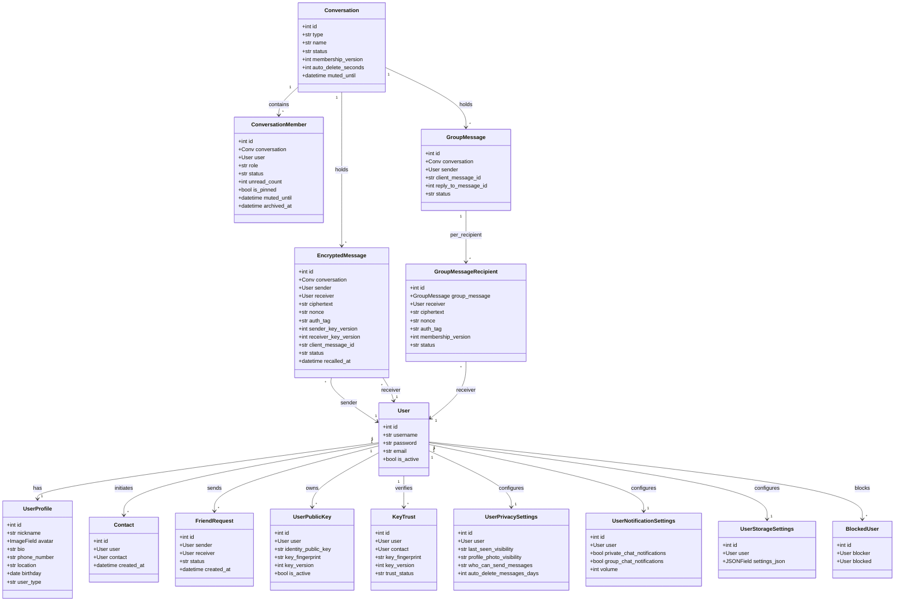
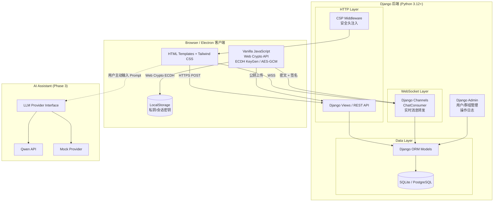
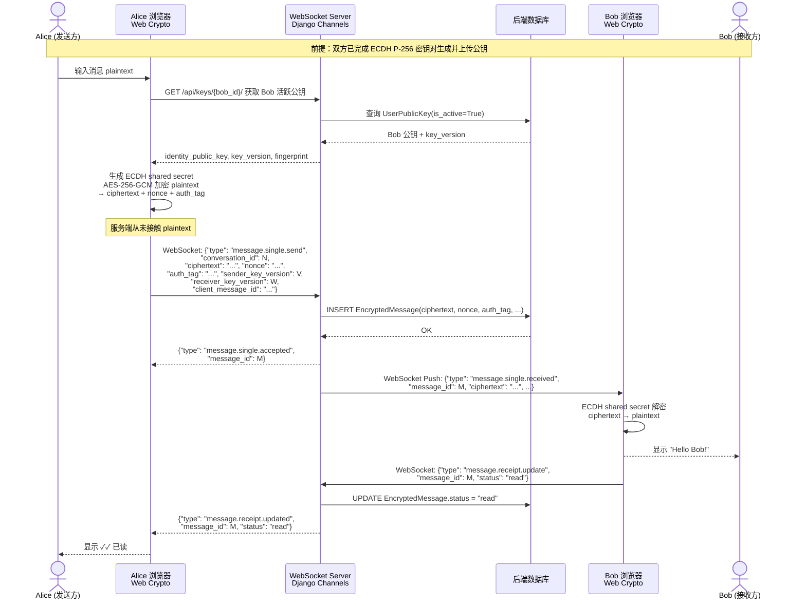
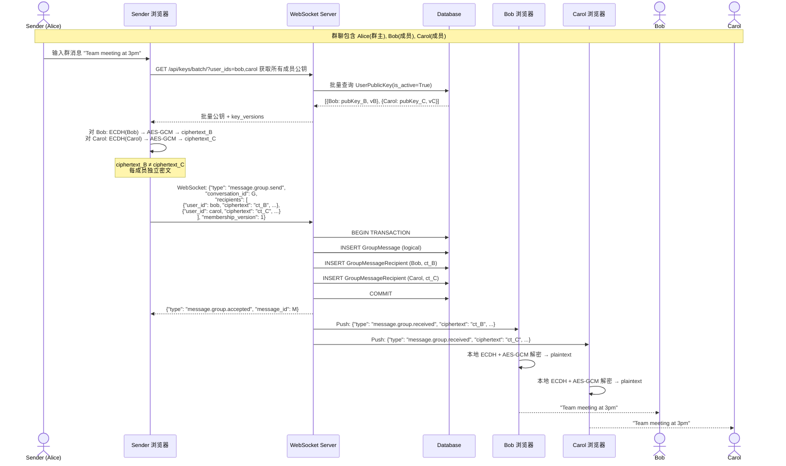
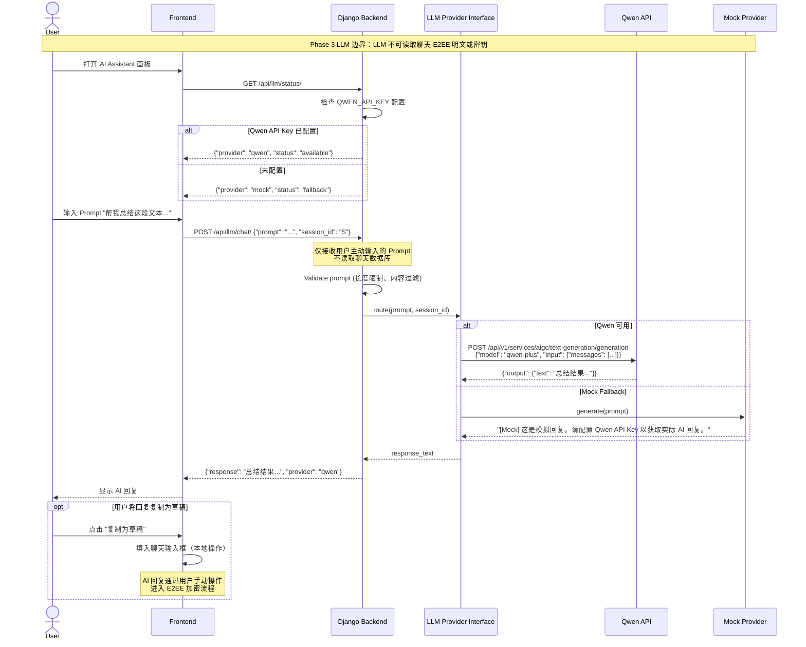
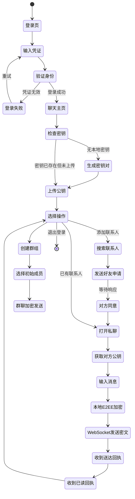
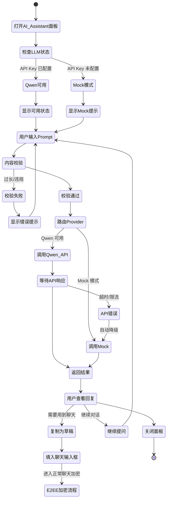

# iChat Pro UML 与架构图交付文档

> 版本：v1.0
> 日期：2026-06-16
> 作者：ketter1024
> 关联 Issue：#120 (P3 T08)
> 渲染引擎：Mermaid （推荐使用 VS Code Mermaid Preview 或 GitHub 原生渲染）

本文档为 iChat Pro 交付 UML 与架构图，覆盖系统用例、核心数据模型、组件架构、端到端加密时序、AI Assistant 交互边界与业务流程。

> **Phase 3 LLM 边界声明**：所有图表中 LLM/AI Assistant 组件**不**读取聊天数据库中的 E2EE 明文，**不**持有或接触任何用户私钥、ECDH 会话密钥或 Key Encryption Key，仅处理用户主动输入的 Prompt 文本。

---

## 1. 系统用例图

```mermaid
graph TB
    subgraph Actors
        U[👤 普通用户]
        A[👤 管理员]
        Q[🤖 Qwen API / LLM Provider]
    end

    subgraph "iChat Pro System"
        subgraph "账号模块"
            UC1[注册]
            UC2[登录]
            UC3[退出]
        end
        subgraph "社交模块"
            UC4[搜索联系人]
            UC5[发送/接受好友申请]
            UC6[管理联系人]
        end
        subgraph "聊天模块"
            UC7[私聊 E2EE 收发]
            UC8[群聊逐成员加密收发]
            UC9[消息操作 - 撤回/删除/转发/回复]
        end
        subgraph "群管理模块"
            UC10[创建群组]
            UC11[邀请/移除成员]
            UC12[群主转让/管理员设置]
        end
        subgraph "AI Assistant 模块"
            UC13[通用问答]
            UC14[文本摘要]
            UC15[草稿生成]
        end
        subgraph "管理模块"
            UC16[管理用户/群组]
            UC17[查看操作日志]
        end
    end

    U --> UC1
    U --> UC2
    U --> UC3
    U --> UC4
    U --> UC5
    U --> UC6
    U --> UC7
    U --> UC8
    U --> UC9
    U --> UC10
    U --> UC11
    U --> UC12
    U --> UC13
    U --> UC14
    U --> UC15
    A --> UC16
    A --> UC17
    Q --> UC13
    Q --> UC14
    Q --> UC15
```

**说明：** 普通用户覆盖注册到聊天的完整闭环；管理员负责用户/群组管理和审计；Qwen API 是 AI Assistant 的外部 LLM 提供商，仅处理用户主动输入的 Prompt，不接触 E2EE 密钥体系。

---

## 2. 核心类图

**说明：** 核心类图覆盖 15 个关键模型。`Conversation` 统一承载私聊与群聊，`EncryptedMessage` 只存密文。`GroupMessage` + `GroupMessageRecipient` 实现逐成员独立密文。`KeyTrust` 追踪用户对联系人密钥的验证状态。Phase 3 LLM 相关类（LLMProvider/QwenProvider/MockProvider）为规划中新增，不在此图主体。

---

## 3. 系统组件图

**说明：** 前端为 Django Templates + Vanilla JavaScript，使用浏览器 Web Crypto API 在客户端完成密钥生成和 AES-GCM 加密。后端 Django 通过 HTTP API 和 WebSocket 提供服务。CSP 中间件注入安全头。AI Assistant 模块独立于 E2EE 密钥体系，仅接收用户主动输入的 Prompt。

> ⚠️ **Phase 3 LLM 边界**：LLM 组件不连接到 `EncryptedMessage`/`GroupMessage` 表，不接触 `UserPublicKey`，不读取 LocalStorage 私钥。箭头 `.->` 表示受控调用路径。

---

## 4. 私聊 E2EE 时序图

**说明：** 私聊 E2EE 全流程：获取对方公钥 → 客户端 ECDH → 本地 AES-GCM 加密 → WebSocket 密文传输 → 服务端存转发 → 接收方本地解密。**服务端在任何环节都不接触消息明文**。送达回执（delivered）和已读回执（read）仅标记状态，不传递明文。

---

## 5. 群聊逐成员加密时序图

**说明：** 群聊采用"一个逻辑消息 + 逐成员独立密文副本"模型。发送方为每个在线成员单独加密，`ciphertext_B ≠ ciphertext_C`。服务端存储逻辑消息和按收件人分组的密文副本，新成员无法解密加入前的历史消息。

---

## 6. AI Assistant 时序图

**说明：** AI Assistant 的 LLM 组件仅处理用户主动输入的 Prompt，**不**自动读取聊天数据库中的密文或明文。用户如需将 AI 回复用于聊天，需手动复制粘贴——此时内容进入正常的 E2EE 加密流程。Mock Provider 确保在无 API Key 时仍可演示。

> ⚠️ **Phase 3 LLM 边界**：LLM Provider 不持有 `User` 私钥，不访问 `EncryptedMessage`/`GroupMessage` 表，不解密 Session Key，不参与 ECDH 密钥协商。其职责严格限定为：接收用户 Prompt → 调用外部 API → 返回文本。

---

## 7. 活动图：用户从登录到聊天

**说明：** 从登录开始，经历密钥初始化（如需要）、联系人建立、私聊 E2EE 加密发送的完整活动流程。每条消息在发送前必须完成：获取接收方公钥 → 本地生成 ECDH Shared Secret → AES-256-GCM 加密 → 密文通过 WebSocket 发送。

---

## 8. 活动图：AI Assistant 使用流程

**说明：** AI Assistant 使用流程的核心安全约束：用户输入 Prompt 后**不读取聊天数据库**，LLM 回复**不自动进入 E2EE 聊天**——用户需手动复制。Qwen API 调用失败时自动降级到 Mock 模式，确保演示路径不中断。

---

## 9. 交付总结

| # | 图名 | 类型 | 状态 |
|---|------|------|------|
| 1 | 系统用例图 | Use Case | ✅ |
| 2 | 核心类图 | Class Diagram | ✅ |
| 3 | 系统组件图 | Component Diagram | ✅ |
| 4 | 私聊 E2EE 时序图 | Sequence Diagram | ✅ |
| 5 | 群聊逐成员加密时序图 | Sequence Diagram | ✅ |
| 6 | AI Assistant 时序图 | Sequence Diagram | ✅ |
| 7 | 用户从登录到聊天活动图 | Activity Diagram | ✅ |
| 8 | AI Assistant 使用流程活动图 | Activity Diagram | ✅ |

**共交付 8 张 Mermaid 图**（最低要求 5 张），覆盖全部核心模块、E2EE 加密链路和 Phase 3 LLM 接入边界。

所有图表可在 GitHub 上直接渲染（Mermaid 原生支持），也可在 VS Code 中安装 Mermaid Preview 插件查看。

### 当前代码一致性校验

- **类图一致性**：类图覆盖的 15 个模型与 `accounts/models.py` 和 `chat/models.py` 定义一致。LLMProvider/QwenProvider/MockProvider 为 Phase 3 规划新增，尚未在代码中创建。
- **时序图一致性**：私聊 E2EE 流程与 `static/js/private-chat-e2ee.js` 和 `chat/consumers.py` 实现一致。
- **组件图一致性**：架构分层与实际部署拓扑一致（Django + Channels + SQLite + Browser Web Crypto + Electron Shell）。
- **AI Assistant 边界**：所有图表遵从 Phase 3 LLM 不放开 E2EE 明文访问的安全约束。
