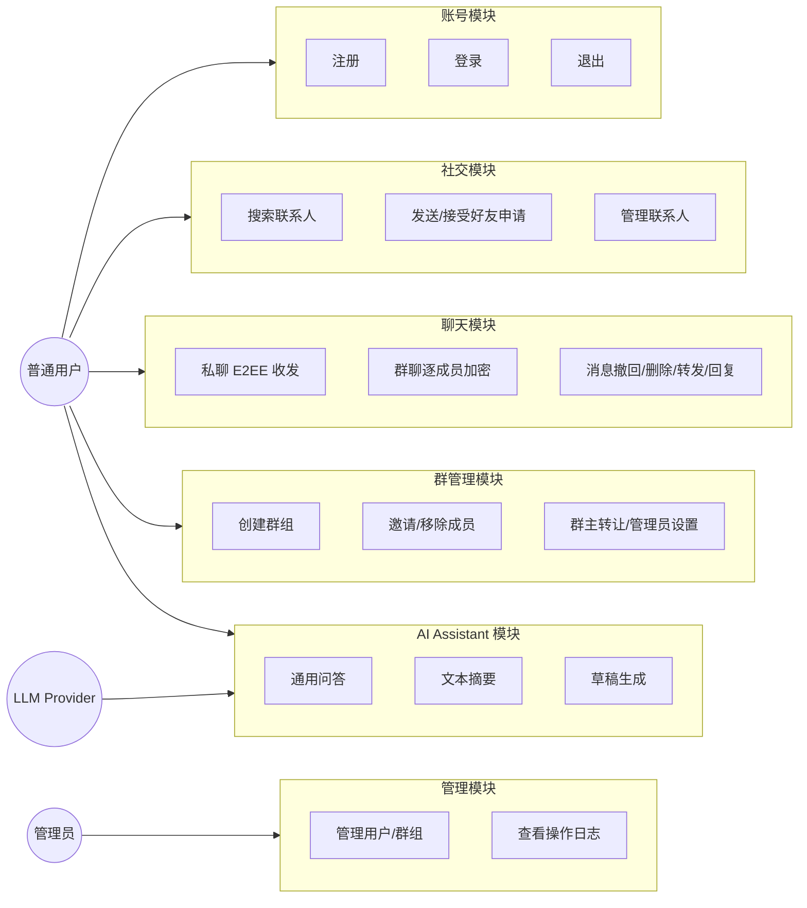
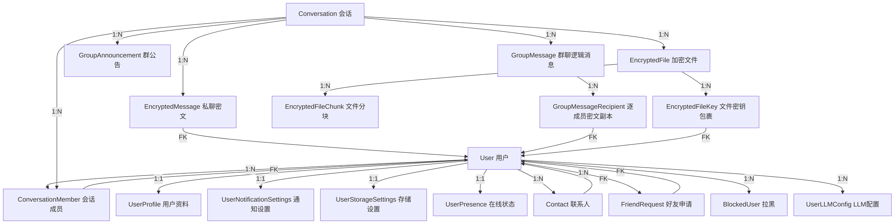
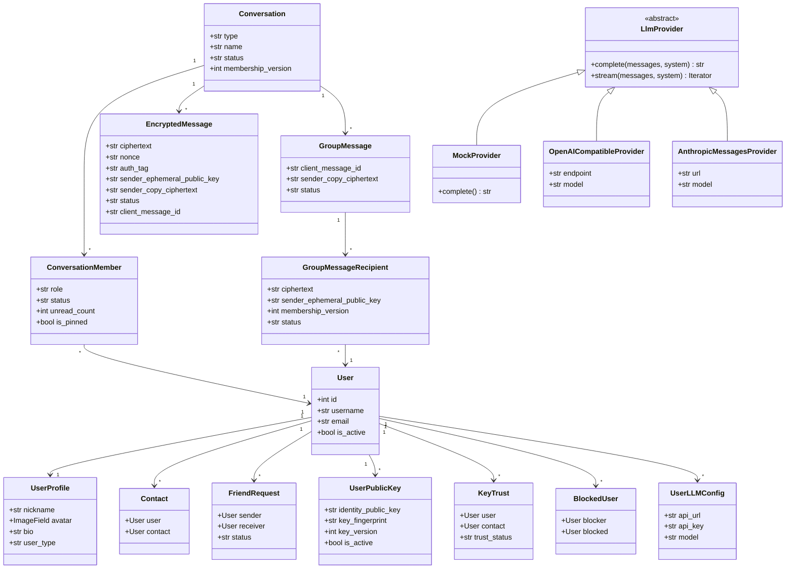
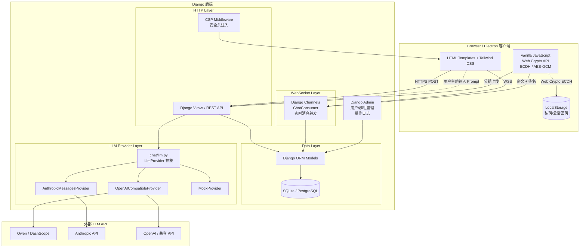
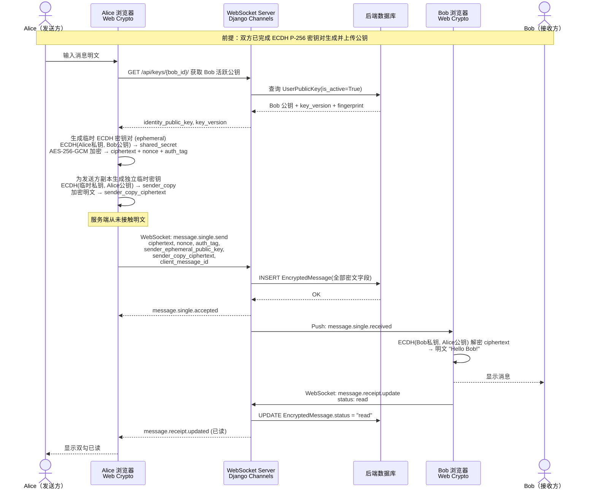
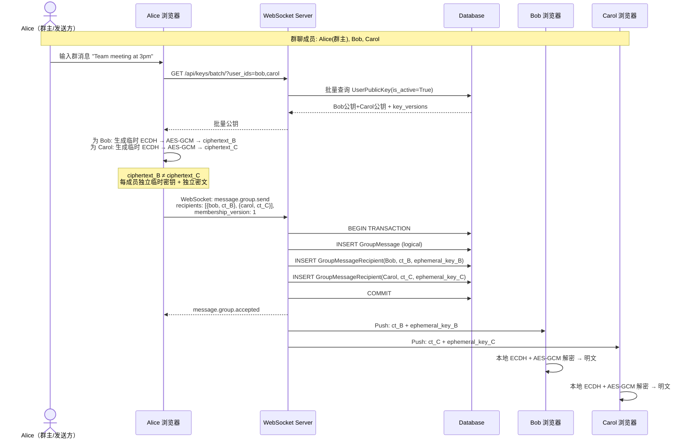
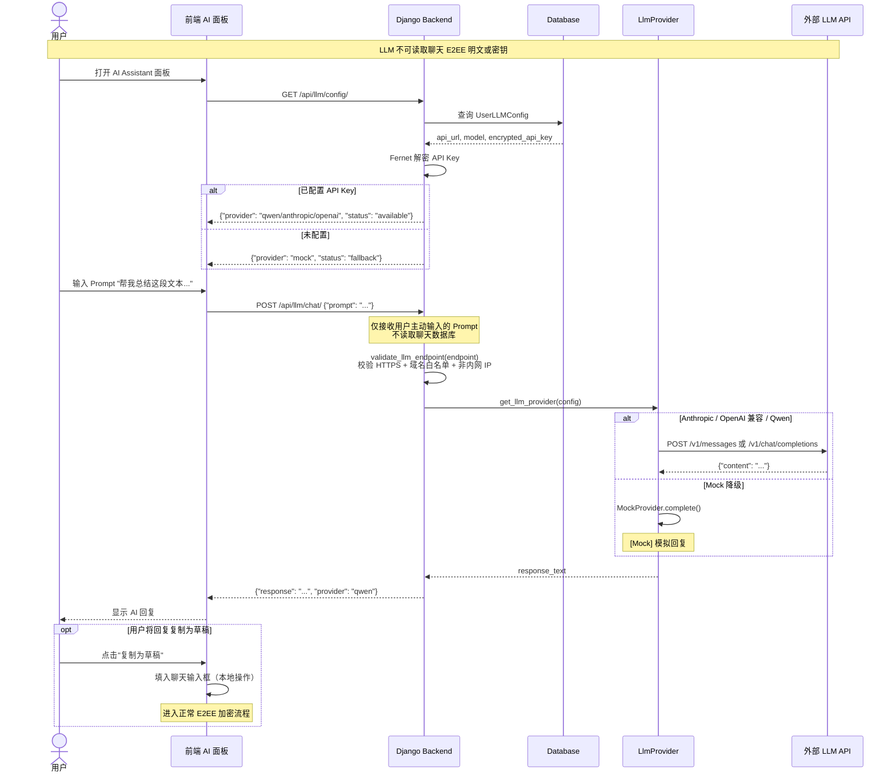
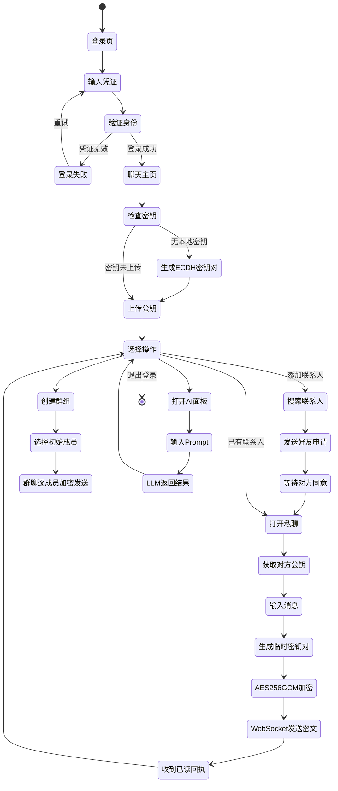
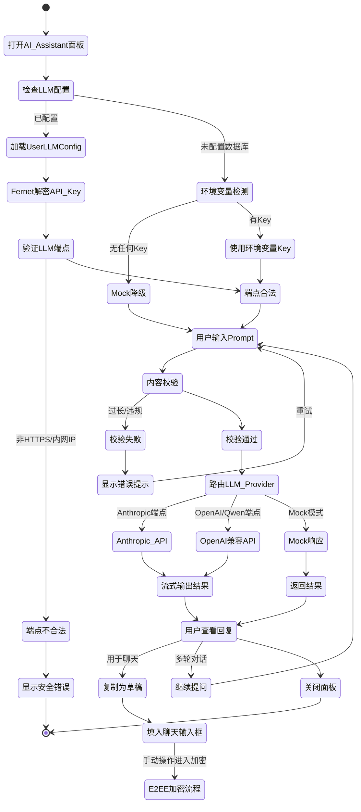

# iChat Pro UML 与架构图交付文档

> 版本：v2.0
> 日期：2026-06-24
> 作者：ketter1024
> 关联 Issue：#120 (P3 T08) · 修复 Issue：#124
> 渲染引擎：Mermaid（推荐 VS Code Mermaid Preview 或 GitHub 原生渲染）

本文档为 iChat Pro 交付 UML 与架构图，覆盖系统用例、数据库 ER 模型、核心类结构、组件架构、端到端加密时序、AI Assistant 交互边界与业务流程。所有图表基于 **2026-06-24 main 分支代码** 绘制。

> **Phase 3 LLM 边界声明**：所有图表中 LLM/AI Assistant 组件**不**读取聊天数据库中的 E2EE 明文，**不**持有或接触任何用户私钥、ECDH 会话密钥或 Key Encryption Key，仅处理用户主动输入的 Prompt 文本。

---

## 1. 系统用例图

**说明：** 普通用户覆盖注册到聊天的完整闭环；管理员负责用户/群组管理和审计；LLM Provider（Qwen / Anthropic / OpenAI 兼容）是 AI Assistant 的外部 LLM 提供商，仅处理用户主动输入的 Prompt，不接触 E2EE 密钥体系。采用 `graph LR` 水平布局，Actor 在左、用例模块在右。

---

## 2. 数据库 ER 图

**核心实体字段说明：**

| 实体 | 关键字段 |
|------|----------|
| User | id(PK), username, password, email |
| UserProfile | user_id(FK), nickname, avatar, bio, user_type |
| Conversation | id(PK), type(single\|group), status, membership_version |
| EncryptedMessage | conversation_id(FK), sender_id(FK), receiver_id(FK), ciphertext, nonce, auth_tag, client_message_id, status |
| GroupMessage | conversation_id(FK), sender_id(FK), client_message_id, status |
| GroupMessageRecipient | group_message_id(FK), receiver_id(FK), ciphertext, nonce, auth_tag, membership_version |
| UserLLMConfig | user_id(FK), api_url, api_key(Fernet加密), model |

**说明：** ER 图采用 `flowchart TD` 纵向布局，从上到下依次为 User → 设置表 → 关系表 → Conversation → 消息密文表。User 为中枢，Conversation 统一承载私聊与群聊。`%%{init}%%` 指令解除 Mermaid 最大宽度限制。密钥相关实体（UserPublicKey、KeyTrust 等）和详细字段参见类图。

---

## 3. 核心类图

**说明：** 核心类图聚焦 17 个关键类。`Conversation` 统一承载私聊与群聊。消息密文仅存 `EncryptedMessage`（私聊）和 `GroupMessage` + `GroupMessageRecipient`（群聊逐成员副本），含 `sender_ephemeral_public_key` 和 `sender_copy_ciphertext` 前向保密字段。`UserLLMConfig` 以 Fernet 加密存储 API Key。`LlmProvider` 抽象类派生出 Mock、OpenAI 兼容、Anthropic 三种实现。其余 settings 类（Privacy、Notification、Storage 等）和文件传输类属辅助模型，未在图中展开。

---

## 4. 系统组件图

**说明：** 前端使用浏览器 Web Crypto API 在客户端完成密钥生成和 AES-256-GCM 加密，私钥仅存 LocalStorage。后端 Django + Channels 通过 HTTP REST API 和 WebSocket 提供服务。CSP 中间件注入安全头。LLM Provider 层支持 Anthropic Messages API、OpenAI 兼容 API（含 Qwen/DashScope）和 Mock 降级，IP/域名白名单校验防止 SSRF。AI 模块不连接到消息密文表或密钥表。

> ⚠️ **Phase 3 LLM 边界**：LLM 组件不读取 `EncryptedMessage`/`GroupMessage` 表，不接触 `UserPublicKey`，不读取 LocalStorage 私钥。虚线 `.->` 表示受控调用路径。

---

## 5. 私聊 E2EE 时序图（含前向保密）

**说明：** 私聊 E2EE 全流程，包含 Phase 3 新增的前向保密（Forward Secrecy）：发送方生成临时 ECDH 密钥对，接收方密文和发送方副本分别使用独立临时密钥加密。`sender_copy_ciphertext` 允许发送方在其他设备解密自己发送的消息。服务端在任何环节不接触明文，已读回执仅标记状态。

---

## 6. 群聊逐成员加密时序图（含邀请流程）

**说明：** 群聊采用"一个逻辑消息 + 逐成员独立临时密钥 + 独立密文副本"模型。发送方为每个成员单独生成临时 ECDH 密钥对并加密，`ciphertext_B ≠ ciphertext_C`。`membership_version` 校验确保成员变更后消息只面向当前有效成员。Phase 3 新增 `GroupInvitation` 两步邀请流程（管理员审批 → 受邀者确认）。

---

## 7. AI Assistant 时序图

**说明：** AI Assistant 的 LLM 组件仅处理用户主动输入的 Prompt，**不**自动读取聊天密文或明文。API Key 通过 Fernet 加密存储在 `UserLLMConfig`。`validate_llm_endpoint()` 对用户配置的 LLM 端点进行 HTTPS 校验、域名白名单过滤和 SSRF 防护（禁止私有/环回/保留 IP）。MockProvider 确保无 API Key 时仍可演示。

> ⚠️ **安全边界**：LLM Provider 不持有用户私钥，不访问 `EncryptedMessage`/`GroupMessage` 表，不解密 Session Key，不参与 ECDH 密钥协商。

---

## 8. 活动图：用户从登录到聊天

**说明：** 从登录开始，经历密钥初始化（如需要）、联系人建立、私聊 E2EE 加密发送（含临时密钥生成）、群聊逐成员加密、AI Assistant 使用的完整活动流程。每条消息发送前生成临时 ECDH 密钥对实现前向保密。

---

## 9. 活动图：AI Assistant 使用流程

**说明：** AI Assistant 使用流程的核心安全约束：配置优先从 `UserLLMConfig`（Fernet 加密）读取，其次检测环境变量。`validate_llm_endpoint()` 校验 HTTPS、域名白名单和 IP 合法性后方可调用。LLM 回复**不自动**进入 E2EE 聊天——用户需手动复制粘贴触发本地加密流程。调用失败时自动降级到 MockProvider。

---

## 10. 交付总结

| # | 图名 | 类型 | 状态 |
|---|------|------|------|
| 1 | 系统用例图 | Use Case Diagram | ✅ |
| 2 | 数据库 ER 图 | ER Diagram | ✅ (新增) |
| 3 | 核心类图 | Class Diagram | ✅ |
| 4 | 系统组件图 | Component Diagram | ✅ |
| 5 | 私聊 E2EE 时序图（含前向保密） | Sequence Diagram | ✅ |
| 6 | 群聊逐成员加密时序图（含邀请流程） | Sequence Diagram | ✅ |
| 7 | AI Assistant 时序图 | Sequence Diagram | ✅ |
| 8 | 用户从登录到聊天活动图 | Activity Diagram | ✅ |
| 9 | AI Assistant 使用流程活动图 | Activity Diagram | ✅ |

**共交付 9 张 Mermaid 图**（最低要求 5 张），新增数据库 ER 图，覆盖全部核心模块、E2EE 加密链路、前向保密机制和 Phase 3 LLM 接入边界。

所有图表可在 GitHub 上直接渲染（Mermaid 原生支持）。

### 当前代码一致性校验

- **ER 图一致性**：图中所列关系与 `accounts/models.py`（16 个模型）和 `chat/models.py`（17 个模型）完全对应，字段详见 ER 图下方表格。
- **类图一致性**：聚焦 17 个核心类，新增 `UserLLMConfig`、`LlmProvider` 及 3 个实现类，`EncryptedMessage`/`GroupMessage`/`GroupMessageRecipient` 均已加入前向保密字段。辅助 settings 类和文件传输类在说明文字中标注。
- **时序图一致性**：私聊/群聊 E2EE 流程与 `static/js/private-chat-e2ee.js`、`static/js/group-chat-e2ee.js` 和 `chat/consumers.py` 实现一致；AI Assistant 流程与 `chat/llm.py`（`get_llm_provider`、`validate_llm_endpoint`）一致。
- **组件图一致性**：架构分层与 `ichat_pro/settings.py`（Django + Channels + CSP Middleware）、前端模板结构和 `package.json`（Electron + Tailwind）对应。
- **LLM 安全边界**：所有图表遵从 `chat/llm.py` 中 `validate_llm_endpoint()` 的 SSRF 防护和 `UserLLMConfig` 的 Fernet 加密方案。
