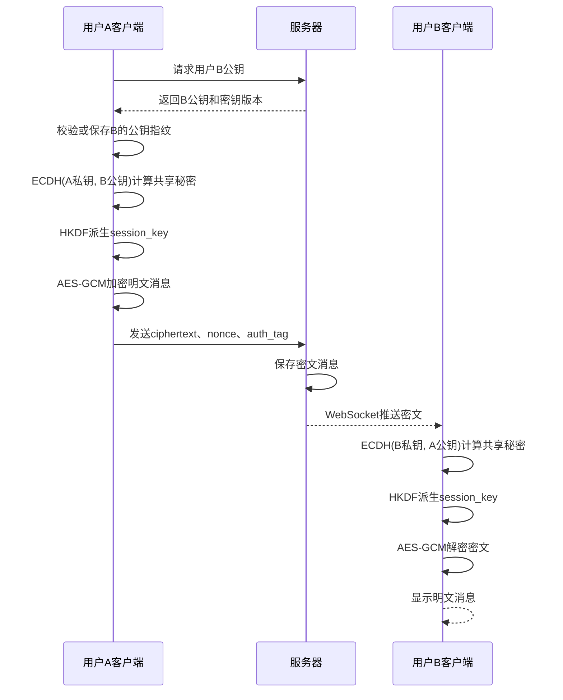
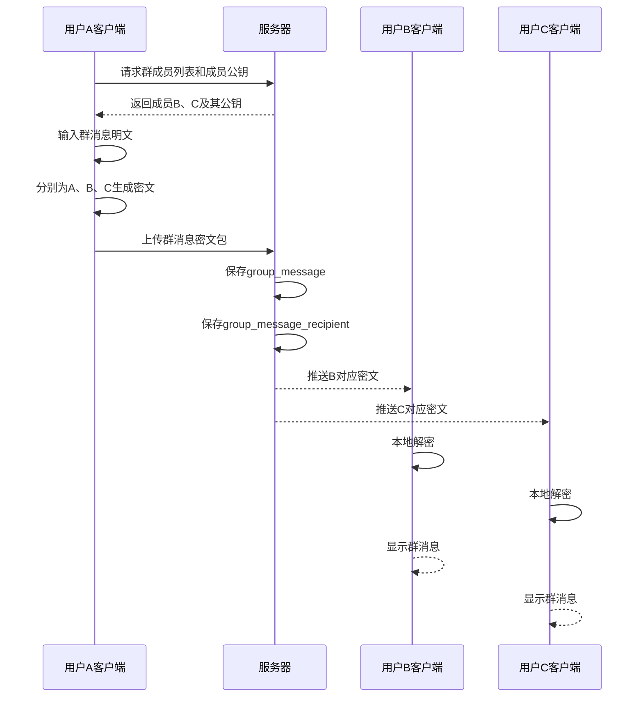
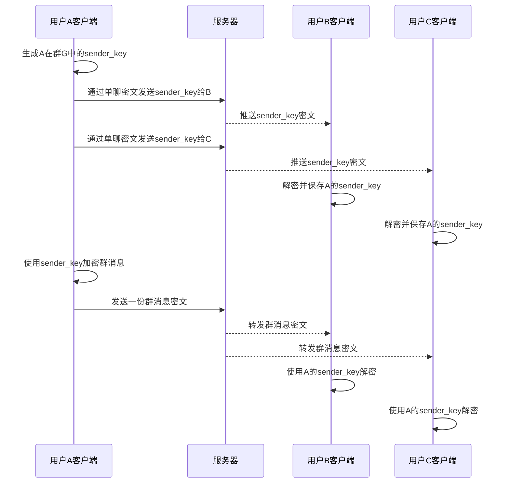

# iChat Pro 端到端加密通信设计文档

## 1. 设计目标

本系统是一款支持即时通信的聊天软件，为了保护用户聊天内容的隐私安全，系统采用端到端加密通信机制。端到端加密的核心思想是：消息明文只在发送方客户端和接收方客户端中出现，服务器只负责用户认证、公钥管理、密文存储和消息转发，不保存、不解析、不处理任何聊天明文。

本系统端到端加密设计分为两个实现层级：

| 层级   | 名称                        | 目标                                               | 实现优先级   |
| ------ | --------------------------- | -------------------------------------------------- | ------------ |
| 第一层 | 基础可演示版端到端加密      | 完成单聊和群聊的基础端到端加密，服务器只保存密文   | 必须完成     |
| 第二层 | Signal 风格增强版端到端加密 | 引入更高级的密钥协商、密钥轮换和群聊发送者密钥机制 | 有时间再完成 |

当前版本优先实现第一层方案，即“ECDH 密钥协商 + HKDF 密钥派生 + AES-GCM 消息加密”的基础端到端加密架构。该方案能够保证服务器无法通过数据库中的密文直接还原用户聊天内容，同时保留后续升级为 Signal 风格加密机制的扩展空间。

------

## 2. 端到端加密基本原则

系统设计遵循以下安全原则：

1. 用户私钥只保存在客户端本地，服务器不保存用户私钥。
2. 会话密钥只在通信双方客户端本地生成或派生，服务器不生成、不保存会话密钥。
3. 消息发送前在发送方客户端加密，消息接收后在接收方客户端解密。
4. 服务器只保存密文、随机数、认证标签、发送者、接收者、时间等必要数据。
5. 数据库中不得出现消息明文字段，例如 `plaintext`、`content_plain` 等。
6. 群聊基础版采用逐成员加密方案，即发送者分别为每个群成员生成对应密文。
7. 客户端应保存联系人公钥指纹，并在公钥变化时提示用户重新验证身份。
8. 系统应明确安全边界，不宣称“绝对安全”。

------

## 3. 加密算法选型

基础版端到端加密采用以下算法组合：

| 算法     | 作用                 | 说明                                                 |
| -------- | -------------------- | ---------------------------------------------------- |
| ECDH     | 密钥协商             | A 和 B 使用“自己的私钥 + 对方的公钥”计算相同共享秘密 |
| HKDF     | 密钥派生             | 将 ECDH 得到的共享秘密派生为可用于加密的会话密钥     |
| AES-GCM  | 消息加密与完整性校验 | 使用会话密钥加密明文，并生成认证标签                 |
| nonce/iv | 随机数               | 每条消息生成一次，防止相同明文得到相同密文           |
| auth_tag | 认证标签             | 检查密文是否被篡改                                   |

三者分工如下：

```text
ECDH：让 A 和 B 在不直接传输密钥的情况下得到相同共享秘密
HKDF：把共享秘密派生为格式规范、长度固定、用途隔离的 session_key
AES-GCM：使用 session_key 加密消息，并验证消息完整性
```

------

## 4. A、B、服务器分别拥有的数据

### 4.1 用户 A 拥有的数据

| 数据               | 是否公开 | 说明                                              |
| ------------------ | -------- | ------------------------------------------------- |
| `A_private_key`    | 不公开   | A 的私钥，只保存在 A 客户端                       |
| `A_public_key`     | 公开     | A 的公钥，可上传服务器                            |
| `B_public_key`     | 公开     | A 从服务器获取的 B 的公钥                         |
| `shared_secret_AB` | 不公开   | A 使用 `A_private_key` 和 `B_public_key` 计算得到 |
| `session_key_AB`   | 不公开   | A 通过 HKDF 从共享秘密派生得到                    |
| `plaintext`        | 不公开   | A 输入的消息明文                                  |
| `ciphertext`       | 可公开   | 使用 `session_key_AB` 加密后的密文                |
| `nonce`            | 可公开   | AES-GCM 加密时使用的随机数                        |
| `auth_tag`         | 可公开   | AES-GCM 生成的完整性校验标签                      |

### 4.2 用户 B 拥有的数据

| 数据               | 是否公开 | 说明                                              |
| ------------------ | -------- | ------------------------------------------------- |
| `B_private_key`    | 不公开   | B 的私钥，只保存在 B 客户端                       |
| `B_public_key`     | 公开     | B 的公钥，可上传服务器                            |
| `A_public_key`     | 公开     | B 从服务器或消息头中获取的 A 的公钥               |
| `shared_secret_AB` | 不公开   | B 使用 `B_private_key` 和 `A_public_key` 计算得到 |
| `session_key_AB`   | 不公开   | B 通过 HKDF 从共享秘密派生得到                    |
| `ciphertext`       | 可公开   | B 从服务器收到的密文                              |
| `nonce`            | 可公开   | 解密时需要使用                                    |
| `auth_tag`         | 可公开   | 用于校验消息是否被篡改                            |
| `plaintext`        | 不公开   | B 解密后得到的消息明文                            |

### 4.3 服务器拥有的数据

| 数据               | 是否拥有 | 能否解密 | 说明                           |
| ------------------ | -------- | -------- | ------------------------------ |
| `A_public_key`     | 拥有     | 不能     | 公钥可以公开                   |
| `B_public_key`     | 拥有     | 不能     | 公钥可以公开                   |
| `ciphertext`       | 拥有     | 不能     | 只是密文                       |
| `nonce`            | 拥有     | 不能     | nonce 不是密钥                 |
| `auth_tag`         | 拥有     | 不能     | auth_tag 用于完整性校验        |
| `A_private_key`    | 不拥有   | 关键缺失 | A 私钥只在 A 客户端            |
| `B_private_key`    | 不拥有   | 关键缺失 | B 私钥只在 B 客户端            |
| `shared_secret_AB` | 不拥有   | 关键缺失 | 服务器无法通过两个公钥计算得到 |
| `session_key_AB`   | 不拥有   | 关键缺失 | 服务器无法派生会话密钥         |
| `plaintext`        | 不拥有   | 无法获得 | 服务器无法还原明文             |

------

## 5. ECDH 密钥协商原理

ECDH 的核心数学思想是：A 使用自己的私钥和 B 的公钥计算共享秘密，B 使用自己的私钥和 A 的公钥计算共享秘密，双方得到的结果相同。

设公开椭圆曲线基点为 `G`。

A 的密钥为：

```text
A_private_key = a
A_public_key = aG
```

B 的密钥为：

```text
B_private_key = b
B_public_key = bG
```

A 计算共享秘密：

```text
shared_secret_AB = ECDH(A_private_key, B_public_key)
                 = a(bG)
                 = abG
```

B 计算共享秘密：

```text
shared_secret_AB = ECDH(B_private_key, A_public_key)
                 = b(aG)
                 = baG
```

由于 `ab = ba`，所以：

```text
a(bG) = b(aG)
```

因此 A 和 B 可以在不直接传输会话密钥的情况下，在各自客户端本地计算出相同的共享秘密。

服务器虽然拥有 `A_public_key = aG` 和 `B_public_key = bG`，但没有 `a` 或 `b`，无法计算出 `abG`，因此无法得到共享秘密。

------

## 6. HKDF 密钥派生设计

ECDH 得到的是共享秘密，但共享秘密不应直接作为 AES-GCM 的加密密钥。因此系统使用 HKDF 对共享秘密进行派生，生成最终用于消息加密的 `session_key`。

派生过程如下：

```text
shared_secret_AB = ECDH(A_private_key, B_public_key)

session_key_AB = HKDF(
    input_key_material = shared_secret_AB,
    salt = conversation_id,
    info = "chat-message-encryption-v1",
    output_length = 32 bytes
)
```

HKDF 的作用包括：

1. 将 ECDH 输出整理为长度固定的密钥。
2. 让密钥分布更接近随机。
3. 将密钥与具体会话绑定，避免不同会话复用同一个密钥。
4. 支持后续为不同用途派生不同密钥，例如消息密钥、文件密钥、群聊密钥包装密钥等。

服务器即使知道 `conversation_id`、`info` 和双方公钥，也因为没有 ECDH 共享秘密，无法派生出 `session_key_AB`。

------

## 7. AES-GCM 消息加密设计

AES-GCM 负责真正加密消息正文，并验证密文是否被篡改。

A 发送消息时，客户端执行：

```text
ciphertext, auth_tag = AES-GCM-Encrypt(
    key = session_key_AB,
    nonce = random_nonce,
    plaintext = message_plaintext
)
```

其中：

| 数据             | 说明         | 是否保密                             |
| ---------------- | ------------ | ------------------------------------ |
| `session_key_AB` | 会话密钥     | 必须保密                             |
| `plaintext`      | 消息明文     | 必须保密                             |
| `ciphertext`     | 加密后的密文 | 可被服务器保存                       |
| `nonce`          | 随机数       | 可被服务器保存，但同一密钥下不得重复 |
| `auth_tag`       | 认证标签     | 可被服务器保存，用于校验完整性       |

B 接收消息后，客户端执行：

```text
plaintext = AES-GCM-Decrypt(
    key = session_key_AB,
    nonce = nonce,
    ciphertext = ciphertext,
    auth_tag = auth_tag
)
```

如果密文、随机数、认证标签或密钥不匹配，则解密失败，客户端显示：

```text
该消息无法解密，可能由于密钥变更或消息损坏。
```

------

## 8. 单聊端到端加密流程

### 8.1 用户注册或首次登录

1. 用户注册或首次登录系统。
2. 客户端本地生成身份密钥对。
3. 私钥 `private_key` 只保存在客户端本地。
4. 公钥 `public_key` 上传服务器。
5. 服务器保存用户公钥，用于其他用户发起加密会话。

服务器保存：

```text
user_id
username
password_hash
identity_public_key
key_version
created_at
```

服务器不得保存：

```text
identity_private_key
shared_secret
session_key
plaintext
```

### 8.2 A 向 B 发送消息

1. A 客户端向服务器请求 B 的公钥。
2. 服务器返回 B 的公钥和密钥版本号。
3. A 客户端检查本地是否保存过 B 的公钥指纹。
4. 如果是首次通信，则保存 B 的公钥指纹。
5. 如果 B 的公钥发生变化，则提示“对方安全密钥已变更，请重新验证身份”。
6. A 客户端使用 `A_private_key` 和 `B_public_key` 执行 ECDH，得到共享秘密。
7. A 客户端使用 HKDF 派生出 `session_key_AB`。
8. A 客户端生成随机 `nonce`。
9. A 客户端使用 AES-GCM 加密明文消息，生成 `ciphertext` 和 `auth_tag`。
10. A 客户端将密文消息发送给服务器。
11. 服务器保存密文并通过 WebSocket 推送给 B。
12. B 客户端收到密文后，使用 `B_private_key` 和 `A_public_key` 计算共享秘密。
13. B 客户端使用 HKDF 派生出相同的 `session_key_AB`。
14. B 客户端使用 AES-GCM 解密消息。
15. 解密成功则显示明文，解密失败则显示错误提示。

### 8.3 单聊消息请求结构

```json
{
  "conversation_id": 1001,
  "sender_id": 1,
  "receiver_id": 2,
  "ciphertext": "base64密文",
  "nonce": "base64随机数",
  "auth_tag": "base64认证标签",
  "algorithm": "AES-GCM",
  "sender_public_key_version": 1,
  "receiver_public_key_version": 1,
  "created_at": "2026-05-28 20:30:00"
}
```

该结构中不包含任何明文消息内容，也不包含会话密钥。

------

## 9. 群聊端到端加密设计

### 9.1 基础版群聊方案

基础版群聊采用逐成员加密方案。发送者在群聊中发送一条消息时，客户端会根据当前群成员列表，分别为每个群成员生成一份对应密文。

例如群聊中有 A、B、C、D 四个成员，A 发送群消息时：

1. A 客户端获取当前群成员列表。
2. A 客户端获取 B、C、D 以及自己的公钥。
3. A 客户端为每个成员分别生成或派生对应的加密密钥。
4. A 客户端分别加密同一条群消息。
5. A 客户端向服务器上传一个群消息密文包。
6. 服务器保存一条群消息记录。
7. 服务器为每个接收者保存一条密文记录。
8. 每个成员只接收属于自己的密文副本。
9. 每个成员在本地解密后显示群消息。

### 9.2 群聊消息请求结构

```json
{
  "group_id": 12,
  "sender_id": 1,
  "message_type": "text",
  "algorithm": "AES-GCM",
  "recipients": [
    {
      "receiver_id": 1,
      "ciphertext": "base64密文A",
      "nonce": "base64随机数A",
      "auth_tag": "base64认证标签A"
    },
    {
      "receiver_id": 2,
      "ciphertext": "base64密文B",
      "nonce": "base64随机数B",
      "auth_tag": "base64认证标签B"
    },
    {
      "receiver_id": 3,
      "ciphertext": "base64密文C",
      "nonce": "base64随机数C",
      "auth_tag": "base64认证标签C"
    }
  ]
}
```

### 9.3 群成员变化处理

| 场景         | 处理方式                                                   |
| ------------ | ---------------------------------------------------------- |
| 新成员加入   | 新成员只能解密加入之后的新消息，不能解密加入之前的历史消息 |
| 成员退出     | 退出成员不再收到新的密文，因此无法读取后续消息             |
| 成员被移除   | 被移除成员不再参与后续密文生成                             |
| 群主修改成员 | 客户端重新获取群成员列表，并按照最新成员列表加密           |
| 历史消息     | 已经发送到成员本地的历史消息无法从其本地强制撤回           |

群成员变化时，聊天界面显示系统消息：

```text
群成员发生变化，后续消息将仅对当前成员加密。
```

------

## 10. 多媒体与大文件端到端加密设计

本系统端到端加密机制不仅适用于文本消息，也适用于图片、语音、视频、文件、表情包等多媒体内容。由于各类消息在计算机中最终都可以表示为字节数据，因此客户端可以统一使用 AES-GCM 对消息字节流进行加密。

对于普通文本和 emoji，系统将消息内容编码为 UTF-8 字节后直接使用会话密钥加密。对于图片、视频和普通文件，系统采用“独立文件密钥 + 文件内容加密 + 文件密钥加密”的方式处理。该方案可以避免直接使用聊天会话密钥加密大文件，同时便于实现分块上传、断点续传和群聊文件共享。

### 10.1 文件加密基本思路

发送图片或文件时，客户端不直接使用 `session_key` 加密整个文件，而是先随机生成一个独立的 `file_key`，再使用 `file_key` 加密文件内容。随后客户端使用当前聊天会话的 `session_key` 加密 `file_key`，并将加密后的 `file_key` 与文件密文一起发送给服务器。

整体流程如下：

```text
文件内容 original_file
        ↓ 使用随机生成的 file_key 加密
加密文件 encrypted_file

file_key
        ↓ 使用 session_key 加密
encrypted_file_key
```

服务器只保存加密后的文件、加密后的文件密钥、随机数、认证标签和文件元数据，不保存原始文件内容，也不保存明文 `file_key`。

### 10.2 100MB 大图片处理流程

对于 100MB 级别的大图片或文件，系统不采用一次性整体加密和上传方式，而是采用分块加密与分块上传方案。

假设用户 A 向用户 B 发送一张 100MB 图片，流程如下：

1. A 客户端选择图片文件，读取文件大小、文件类型等基本信息。
2. A 客户端随机生成一个 32 字节的 `file_key`。
3. A 客户端将图片按固定大小切分为多个分块，例如每块 1MB 或 4MB。
4. A 客户端使用 `file_key` 分别对每个文件块进行 AES-GCM 加密。
5. 每个文件块使用唯一的 `chunk_nonce`，并生成对应的 `chunk_auth_tag`。
6. A 客户端将加密后的文件块分批上传至服务器。
7. A 客户端使用与 B 的 `session_key_AB` 加密 `file_key`，生成 `encrypted_file_key`。
8. 服务器保存加密文件块、加密文件密钥和相关元数据。
9. B 客户端收到文件消息后，先使用 `session_key_AB` 解密 `encrypted_file_key`，得到 `file_key`。
10. B 客户端逐块下载加密图片，使用 `file_key` 解密每个文件块。
11. B 客户端将解密后的文件块按顺序拼接，还原原始图片并显示。

如果按照 4MB 进行分块，则 100MB 图片大约会被分为 25 个文件块。这样可以降低浏览器或客户端一次性读取大文件造成的内存压力，也便于实现上传进度显示和失败重传。

### 10.3 分块加密规则

每个文件块单独加密：

```text
encrypted_chunk_i, chunk_auth_tag_i = AES-GCM-Encrypt(
    key = file_key,
    nonce = chunk_nonce_i,
    plaintext = chunk_i
)
```

其中：

| 数据                | 说明                      |
| ------------------- | ------------------------- |
| `file_key`          | 当前文件专用密钥          |
| `chunk_i`           | 第 i 个文件明文块         |
| `chunk_nonce_i`     | 第 i 个文件块使用的随机数 |
| `encrypted_chunk_i` | 第 i 个文件块密文         |
| `chunk_auth_tag_i`  | 第 i 个文件块认证标签     |

同一个 `file_key` 下，每个 `chunk_nonce_i` 必须唯一，不能重复。系统可以使用“随机前缀 + 分块序号”的方式生成 `chunk_nonce_i`，例如：

```text
chunk_nonce_i = file_nonce_prefix + chunk_index
```

这样可以避免同一个文件内出现 nonce 重复的问题。

### 10.4 单聊文件密钥分发

单聊场景下，文件内容只使用 `file_key` 加密一次。然后发送方使用双方聊天会话的 `session_key_AB` 加密 `file_key`。

```text
encrypted_file_key = AES-GCM-Encrypt(
    key = session_key_AB,
    plaintext = file_key
)
```

服务器保存的是 `encrypted_file_key`，而不是明文 `file_key`。因此服务器即使拥有完整的加密文件，也无法解密文件内容。

### 10.5 群聊文件密钥分发

群聊中不能为每个成员重复加密和上传完整的 100MB 图片，否则会造成严重的计算和存储浪费。群聊文件采用“文件本体加密一次，文件密钥分别加密给每个成员”的方式。

假设群聊中有 A、B、C、D 四个成员，A 发送 100MB 图片时：

```text
100MB 图片本体 → 使用 file_key 加密一次

file_key → 使用 A-B 的 session_key 加密给 B
file_key → 使用 A-C 的 session_key 加密给 C
file_key → 使用 A-D 的 session_key 加密给 D
file_key → 使用 A-A 的本地密钥或会话密钥加密给 A 自己
```

服务器保存一份加密图片文件和多份 `encrypted_file_key`。每个群成员只能解密属于自己的 `encrypted_file_key`，再使用得到的 `file_key` 解密图片内容。

该方案避免了为每个群成员重复上传完整大文件，适合课程项目中的群聊文件端到端加密实现。

### 10.6 缩略图处理

对于图片消息，系统可以在客户端生成缩略图，并对缩略图单独加密上传。聊天界面优先显示缩略图，用户点击图片后再下载和解密原图。

处理方式如下：

| 内容     | 处理方式                                                    |
| -------- | ----------------------------------------------------------- |
| 缩略图   | 客户端压缩生成，单独使用 `thumbnail_key` 或 `file_key` 加密 |
| 原图     | 使用 `file_key` 分块加密上传                                |
| 预览显示 | 接收方先解密缩略图并显示                                    |
| 查看原图 | 用户点击后再下载原图密文并逐块解密                          |

需要注意的是，如果服务器没有密钥，就无法直接生成图片缩略图。因此缩略图必须由发送方客户端生成并加密上传。

### 10.7 文件消息数据结构

文件消息可以使用以下结构表示：

```json
{
  "message_type": "image",
  "file_id": "file_123",
  "file_size": 104857600,
  "chunk_size": 4194304,
  "chunk_count": 25,
  "mime_type": "image/png",
  "encrypted_file_key": "base64加密后的file_key",
  "key_nonce": "base64随机数",
  "key_auth_tag": "base64认证标签"
}
```

文件块上传结构如下：

```json
{
  "file_id": "file_123",
  "chunk_index": 0,
  "chunk_count": 25,
  "encrypted_chunk": "base64密文块",
  "chunk_nonce": "base64随机数",
  "chunk_auth_tag": "base64认证标签"
}
```

### 10.8 文件相关数据表设计

#### encrypted_file 表

| 字段                 | 类型     | 说明               |
| -------------------- | -------- | ------------------ |
| id                   | int      | 文件 ID            |
| message_id           | int      | 对应消息 ID        |
| sender_id            | int      | 发送者 ID          |
| file_ciphertext_path | varchar  | 加密文件存储路径   |
| file_size            | int      | 原文件大小         |
| chunk_size           | int      | 每个文件块大小     |
| chunk_count          | int      | 文件块数量         |
| mime_type            | varchar  | 文件类型           |
| encrypted_filename   | text     | 加密后的原始文件名 |
| created_at           | datetime | 上传时间           |

#### encrypted_file_chunk 表

| 字段           | 类型    | 说明               |
| -------------- | ------- | ------------------ |
| id             | int     | 文件块 ID          |
| file_id        | int     | 所属文件 ID        |
| chunk_index    | int     | 文件块序号         |
| chunk_path     | varchar | 加密文件块存储路径 |
| chunk_nonce    | varchar | 文件块加密随机数   |
| chunk_auth_tag | varchar | 文件块认证标签     |
| chunk_size     | int     | 当前文件块大小     |

#### encrypted_file_key 表

| 字段               | 类型     | 说明                          |
| ------------------ | -------- | ----------------------------- |
| id                 | int      | 主键                          |
| file_id            | int      | 文件 ID                       |
| receiver_id        | int      | 接收者 ID                     |
| encrypted_file_key | text     | 使用会话密钥加密后的 file_key |
| key_nonce          | varchar  | 加密 file_key 使用的随机数    |
| key_auth_tag       | varchar  | 加密 file_key 生成的认证标签  |
| key_version        | int      | 会话密钥版本                  |
| created_at         | datetime | 创建时间                      |

### 10.9 文件上传接口设计

| 接口                                 | 方法 | 功能                   |
| ------------------------------------ | ---- | ---------------------- |
| `/api/files/init`                    | POST | 初始化文件上传任务     |
| `/api/files/{file_id}/chunk`         | POST | 上传单个加密文件块     |
| `/api/files/{file_id}/complete`      | POST | 通知服务器文件上传完成 |
| `/api/files/{file_id}`               | GET  | 获取文件元数据         |
| `/api/files/{file_id}/chunk/{index}` | GET  | 下载指定加密文件块     |

服务器在文件上传过程中只负责保存密文文件块和元数据，不参与文件解密。

### 10.10 文件消息测试用例

| 测试编号   | 测试目标     | 操作                 | 预期结果                                                   |
| ---------- | ------------ | -------------------- | ---------------------------------------------------------- |
| TC-FILE-01 | 图片密文上传 | A 上传图片给 B       | 服务器只保存加密图片，不保存原图                           |
| TC-FILE-02 | 文件密钥保护 | 检查数据库           | 数据库中只保存 `encrypted_file_key`，不保存明文 `file_key` |
| TC-FILE-03 | 大文件分块   | 上传 100MB 图片      | 文件被切分为多个加密分块                                   |
| TC-FILE-04 | 分块解密还原 | B 下载并解密所有分块 | B 客户端成功还原原始图片                                   |
| TC-FILE-05 | 分块篡改检测 | 修改某个加密分块     | 客户端解密失败并提示文件损坏                               |
| TC-FILE-06 | 群聊图片发送 | A 在群聊发送图片     | 图片本体只加密上传一次，`file_key` 分别加密给各成员        |
| TC-FILE-07 | 非接收者访问 | 非群成员下载文件密文 | 无法解密 `file_key`，无法查看图片                          |
| TC-FILE-08 | 缩略图预览   | A 发送图片消息       | B 先看到解密后的缩略图，点击后下载原图                     |

------

## 11. Signal 风格增强方案

如果项目进度允许，系统可在基础版上继续升级为更接近 Signal 的端到端加密机制。

### 11.1 单聊增强：预密钥与双棘轮

基础版中，A 和 B 可以通过 ECDH 派生会话密钥，但如果长期复用同一个会话密钥，前向安全能力不足。

增强版可引入类似 Signal 的设计：

| 机制                    | 作用                       |
| ----------------------- | -------------------------- |
| 预密钥 PreKey           | 支持对方离线时建立加密会话 |
| X3DH/PQXDH 风格密钥协商 | 更安全地建立初始共享密钥   |
| Double Ratchet 双棘轮   | 每条消息派生新的消息密钥   |
| 消息密钥用后删除        | 降低单个密钥泄露后的影响   |

增强后，系统不再长期使用同一个 `session_key` 加密多条消息，而是为每条消息派生独立的 `message_key`。

### 11.2 群聊增强：Sender Key

基础版群聊逐成员加密逻辑清晰，但群成员越多，发送端需要生成的密文越多，效率较低。

增强版可采用 Sender Key 风格方案：

1. 每个群成员作为发送者时，生成自己的 `sender_key`。
2. 发送者通过已有的单聊端到端加密通道，将 `sender_key` 分发给群内成员。
3. 后续该发送者在群内发送消息时，只需要使用自己的 `sender_key` 加密一份群消息。
4. 服务器负责将这一份密文转发给群成员。
5. 群成员使用本地保存的该发送者 `sender_key` 解密消息。

对比：

| 对比项             | 基础版逐成员加密 | 增强版 Sender Key |
| ------------------ | ---------------- | ----------------- |
| 每条群消息密文数量 | 接近群成员数量   | 通常 1 份         |
| 实现复杂度         | 低               | 中高              |
| 发送端计算开销     | 较高             | 较低              |
| 适用阶段           | 当前版本         | 后续扩展          |
| 适用场景           | 小规模群聊       | 中大型群聊        |

------

## 12. 系统架构设计

系统整体架构分为客户端加密层、服务端业务层、数据库存储层和实时通信层。

| 层次         | 模块                   | 职责                               |
| ------------ | ---------------------- | ---------------------------------- |
| 客户端加密层 | 密钥生成模块           | 生成用户身份密钥对                 |
| 客户端加密层 | 密钥协商模块           | 通过 ECDH 计算共享秘密             |
| 客户端加密层 | 密钥派生模块           | 通过 HKDF 生成会话密钥             |
| 客户端加密层 | 消息加密模块           | 通过 AES-GCM 加密明文消息          |
| 客户端加密层 | 消息解密模块           | 接收密文后在本地解密               |
| 客户端加密层 | 本地密钥存储模块       | 保存私钥、联系人公钥指纹、会话状态 |
| 服务端业务层 | 用户认证模块           | 注册、登录、Token 校验             |
| 服务端业务层 | 公钥管理模块           | 保存和查询用户公钥                 |
| 服务端业务层 | 会话管理模块           | 管理单聊和群聊关系                 |
| 服务端业务层 | 密文消息模块           | 保存密文、查询密文、更新消息状态   |
| 实时通信层   | WebSocket 模块         | 实时推送密文消息                   |
| 数据库存储层 | 用户表、密钥表、消息表 | 保存用户、公钥、群成员关系和密文   |

架构原则：

```text
客户端负责加密与解密
服务器负责认证、存储和转发
数据库只保存业务元数据和密文数据
```

------

## 13. 数据模型设计

### 13.1 用户表 user

| 字段          | 类型     | 说明     |
| ------------- | -------- | -------- |
| id            | int      | 用户 ID  |
| username      | varchar  | 用户名   |
| password_hash | varchar  | 密码哈希 |
| nickname      | varchar  | 昵称     |
| avatar        | varchar  | 头像     |
| created_at    | datetime | 创建时间 |

### 13.2 用户密钥表 user_key

| 字段                | 类型     | 说明                   |
| ------------------- | -------- | ---------------------- |
| id                  | int      | 主键                   |
| user_id             | int      | 用户 ID                |
| identity_public_key | text     | 用户身份公钥           |
| pre_key_public      | text     | 预密钥公钥，增强版使用 |
| key_fingerprint     | varchar  | 公钥指纹               |
| key_version         | int      | 密钥版本               |
| is_active           | boolean  | 是否有效               |
| created_at          | datetime | 创建时间               |

说明：该表只保存公钥，不保存私钥。

### 13.3 会话表 conversation

| 字段       | 类型     | 说明         |
| ---------- | -------- | ------------ |
| id         | int      | 会话 ID      |
| type       | varchar  | single/group |
| created_at | datetime | 创建时间     |
| updated_at | datetime | 更新时间     |

### 13.4 会话成员表 conversation_member

| 字段            | 类型     | 说明                |
| --------------- | -------- | ------------------- |
| id              | int      | 主键                |
| conversation_id | int      | 会话 ID             |
| user_id         | int      | 成员 ID             |
| joined_at       | datetime | 加入时间            |
| status          | varchar  | active/left/removed |

### 13.5 单聊密文消息表 encrypted_message

| 字段            | 类型     | 说明                |
| --------------- | -------- | ------------------- |
| id              | int      | 消息 ID             |
| conversation_id | int      | 会话 ID             |
| sender_id       | int      | 发送者 ID           |
| receiver_id     | int      | 接收者 ID           |
| ciphertext      | text     | 密文                |
| nonce           | varchar  | 随机数              |
| auth_tag        | varchar  | 认证标签            |
| algorithm       | varchar  | 加密算法            |
| key_version     | int      | 密钥版本            |
| created_at      | datetime | 发送时间            |
| status          | varchar  | sent/delivered/read |

### 13.6 群聊表 group_chat

| 字段       | 类型     | 说明     |
| ---------- | -------- | -------- |
| id         | int      | 群聊 ID  |
| name       | varchar  | 群名称   |
| avatar     | varchar  | 群头像   |
| owner_id   | int      | 群主 ID  |
| created_at | datetime | 创建时间 |
| updated_at | datetime | 更新时间 |

### 13.7 群成员表 group_member

| 字段      | 类型     | 说明                |
| --------- | -------- | ------------------- |
| id        | int      | 主键                |
| group_id  | int      | 群聊 ID             |
| user_id   | int      | 成员 ID             |
| role      | varchar  | owner/admin/member  |
| joined_at | datetime | 加入时间            |
| left_at   | datetime | 退出时间            |
| status    | varchar  | active/left/removed |

### 13.8 群消息表 group_message

| 字段         | 类型     | 说明                |
| ------------ | -------- | ------------------- |
| id           | int      | 群消息 ID           |
| group_id     | int      | 群聊 ID             |
| sender_id    | int      | 发送者 ID           |
| message_type | varchar  | text/image/file     |
| algorithm    | varchar  | 加密算法            |
| created_at   | datetime | 发送时间            |
| status       | varchar  | sent/delivered/read |

说明：`group_message` 表不保存明文内容。

### 13.9 群消息接收表 group_message_recipient

| 字段         | 类型     | 说明               |
| ------------ | -------- | ------------------ |
| id           | int      | 主键               |
| message_id   | int      | 群消息 ID          |
| receiver_id  | int      | 接收者 ID          |
| ciphertext   | text     | 该接收者对应的密文 |
| nonce        | varchar  | 随机数             |
| auth_tag     | varchar  | 认证标签           |
| key_version  | int      | 密钥版本           |
| delivered_at | datetime | 送达时间           |
| read_at      | datetime | 已读时间           |

------

## 14. 后端接口设计

### 14.1 用户与密钥接口

| 接口                  | 方法 | 功能               |
| --------------------- | ---- | ------------------ |
| `/api/auth/register`  | POST | 用户注册           |
| `/api/auth/login`     | POST | 用户登录           |
| `/api/keys/upload`    | POST | 上传用户公钥       |
| `/api/keys/{user_id}` | GET  | 获取指定用户公钥   |
| `/api/keys/batch`     | POST | 批量获取群成员公钥 |

### 14.2 单聊消息接口

| 接口                              | 方法      | 功能             |
| --------------------------------- | --------- | ---------------- |
| `/api/conversations`              | GET       | 获取会话列表     |
| `/api/messages/send`              | POST      | 发送单聊密文消息 |
| `/api/messages/{conversation_id}` | GET       | 拉取单聊历史密文 |
| `/ws/chat`                        | WebSocket | 单聊消息实时推送 |

### 14.3 群聊接口

| 接口                                    | 方法      | 功能             |
| --------------------------------------- | --------- | ---------------- |
| `/api/groups/create`                    | POST      | 创建群聊         |
| `/api/groups/{group_id}`                | GET       | 获取群信息       |
| `/api/groups/{group_id}/members`        | GET       | 获取群成员列表   |
| `/api/groups/{group_id}/messages/send`  | POST      | 发送群聊密文消息 |
| `/api/groups/{group_id}/messages`       | GET       | 拉取群聊历史密文 |
| `/api/groups/{group_id}/members/add`    | POST      | 添加群成员       |
| `/api/groups/{group_id}/members/remove` | POST      | 移除群成员       |
| `/ws/group-chat`                        | WebSocket | 群聊消息实时推送 |

------

## 15. 时序图设计

### 15.1 单聊端到端加密时序图



### 15.2 群聊端到端加密时序图



### 15.3 Sender Key 增强版群聊时序图



------

## 16. 前端界面表现

端到端加密功能需要在 GUI 中有明确提示，使用户能够感知当前聊天的安全状态。

| 界面位置       | 显示内容                                        |
| -------------- | ----------------------------------------------- |
| 单聊顶部栏     | 锁形图标 + “端到端加密已开启”                   |
| 群聊顶部栏     | 群名称 + 成员数量 + “端到端加密”                |
| 联系人详情页   | “查看安全码”或“验证密钥指纹”                    |
| 设置页         | “隐私与安全”“活跃会话”“密钥管理”                |
| 消息解密失败处 | “该消息无法解密，可能由于密钥变更或消息损坏”    |
| 群成员变化处   | “群成员发生变化，后续消息将仅对当前成员加密”    |
| 数据库演示说明 | 展示数据库中只存在 ciphertext，不存在 plaintext |

------

## 17. 安全边界说明

### 17.1 可以防护的场景

| 威胁                         | 防护效果                         |
| ---------------------------- | -------------------------------- |
| 网络抓包查看消息内容         | 可以防护，因为传输的是密文       |
| 服务器数据库泄露明文         | 可以防护，因为数据库不保存明文   |
| 服务器管理员直接查看聊天内容 | 可以防护，因为服务器没有会话密钥 |
| 消息在传输中被篡改           | 可以通过 AES-GCM 的认证标签检测  |
| 非群成员查看群消息           | 可以防护，因为没有对应密文或密钥 |

### 17.2 不能完全防护的场景

| 风险                   | 原因                                           |
| ---------------------- | ---------------------------------------------- |
| 用户终端中毒           | 明文最终会在客户端显示                         |
| 用户截图或复制外传     | 属于终端侧泄露                                 |
| 服务器恶意替换公钥     | 需要密钥指纹验证机制进一步防护                 |
| 忘记私钥后恢复历史消息 | E2EE 下服务器无法恢复明文                      |
| 通信元数据泄露         | 服务器仍可能知道谁和谁通信、通信时间和消息大小 |
| Web 前端代码被篡改     | 如果服务器能下发恶意 JS，可能破坏 Web 端 E2EE  |

针对公钥替换问题，系统采用首次信任机制。客户端首次获取联系人公钥时保存其指纹，后续如果服务器返回的公钥发生变化，客户端提示用户重新验证身份。

------

## 18. 暴力破解难度说明

在使用安全参数的情况下，例如 X25519 或 P-256 进行 ECDH、HKDF-SHA256 进行密钥派生、AES-256-GCM 进行消息加密，系统在经典计算机攻击模型下具有较高安全强度。

攻击者如果试图暴力破解，需要面对以下困难：

| 目标                   | 难度                                 |
| ---------------------- | ------------------------------------ |
| 从公钥反推出私钥       | 依赖椭圆曲线离散对数问题，现实不可行 |
| 从两个公钥推出共享秘密 | 缺少任一方私钥，现实不可行           |
| 从密文推出明文         | 缺少 session_key，现实不可行         |
| 暴力枚举 AES 密钥      | AES-128 已极难，AES-256 更难         |
| 伪造 auth_tag          | 在标签长度足够时难度极高             |

因此，在私钥不泄露、随机数生成安全、AES-GCM 的 nonce 不重复、算法库实现正确的前提下，服务器或外部攻击者通过暴力破解还原聊天明文在现实条件下不可行。

------

## 19. 系统测试设计

| 测试编号   | 测试目标         | 操作                         | 预期结果                                 |
| ---------- | ---------------- | ---------------------------- | ---------------------------------------- |
| TC-E2EE-01 | 单聊密文存储     | A 向 B 发送 `hello`          | 数据库中不出现 `hello` 明文              |
| TC-E2EE-02 | 单聊正确解密     | B 接收 A 的密文消息          | B 客户端显示 `hello`                     |
| TC-E2EE-03 | 错误用户无法解密 | C 尝试读取 A 发给 B 的消息   | C 无法获得或无法解密消息                 |
| TC-E2EE-04 | 密文篡改检测     | 修改数据库中的 `ciphertext`  | 客户端提示消息无法解密                   |
| TC-E2EE-05 | 群聊密文存储     | A 在群聊中发送 `hello group` | 数据库中只保存多份密文                   |
| TC-E2EE-06 | 群成员解密       | B、C 接收群聊密文            | B、C 均能显示群消息                      |
| TC-E2EE-07 | 非群成员访问     | D 请求该群消息               | 服务器拒绝或 D 无法解密                  |
| TC-E2EE-08 | 新成员加入       | E 加入群聊                   | E 只能查看加入后的新消息                 |
| TC-E2EE-09 | 成员退出         | C 退出后 A 再发消息          | C 不再收到新消息密文                     |
| TC-E2EE-10 | 服务器不可见明文 | 检查消息相关数据表           | 表中无 `plaintext` 或明文 `content` 字段 |
| TC-E2EE-11 | 公钥变化提示     | B 重新生成密钥               | A 端提示对方安全密钥已变更               |
| TC-E2EE-12 | nonce 唯一性     | A 连续发送多条消息           | 每条消息使用不同 nonce                   |

------

## 20. 分阶段实现计划

### 20.1 第一阶段：基础版必须完成

| 任务           | 说明                                                 |
| -------------- | ---------------------------------------------------- |
| 用户注册登录   | 完成账号系统                                         |
| 客户端生成密钥 | 注册或首次登录时生成公私钥                           |
| 公钥上传服务器 | 服务器保存用户公钥                                   |
| 单聊密文发送   | 客户端加密，服务器存密文                             |
| 单聊密文接收   | 接收端本地解密                                       |
| 群聊逐成员加密 | 发送者为每个群成员生成密文                           |
| 群聊密文存储   | 使用 `group_message` 和 `group_message_recipient` 表 |
| GUI 加密提示   | 显示端到端加密状态                                   |
| 基础测试       | 验证数据库无明文、成员可解密、非成员不可解密         |

### 20.2 第二阶段：有时间再完成

| 任务               | 说明                                 |
| ------------------ | ------------------------------------ |
| 密钥指纹验证       | 用户可验证联系人安全码               |
| 单聊密钥棘轮       | 每条消息派生新密钥                   |
| 预密钥机制         | 支持对方离线时建立加密会话           |
| Sender Key 群聊    | 每个发送者维护自己的群发送密钥       |
| 群成员变更密钥轮换 | 成员加入或退出后更新密钥             |
| 多设备密钥管理     | 同一用户多设备分别维护密钥           |
| 更完整安全测试     | 测试密钥变更、重放、旧密钥失效等情况 |

------

## 21. 总结

本系统端到端加密方案采用分阶段设计。当前版本优先实现基础可演示版端到端加密：单聊中，客户端通过 ECDH 和 HKDF 派生会话密钥，并使用 AES-GCM 加密消息；群聊中，发送者客户端根据群成员列表分别为每个成员生成密文。服务器只负责用户认证、公钥管理、密文存储和 WebSocket 转发，不保存用户私钥、会话密钥和消息明文。

该方案能够满足课程项目对于系统架构、数据模型、功能实现和测试展示的要求，同时保留后续升级空间。若项目时间允许，系统可进一步参考 Signal 的设计思想，引入预密钥、双棘轮和 Sender Key 机制，从而增强前向安全性并提升群聊加密效率。