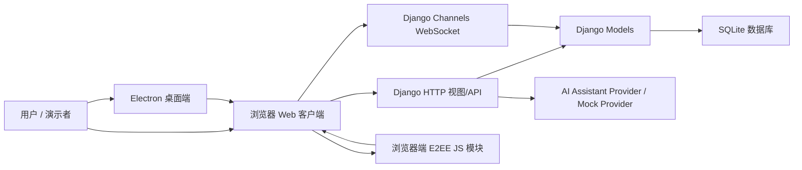

# iChat Pro 系统性介绍文档

## 1. 项目定位

iChat Pro 是一个面向课程小组作业交付的轻量级安全即时通信系统。项目以 Django Web 应用为主体，结合 Django Channels 实现实时通信，并通过 Electron 提供桌面端包装。系统重点展示账号体系、联系人、私聊、群聊、端到端加密消息、基础文件转发、设置中心、AI Assistant 和交付文档体系。

当前版本不是商业级 IM 产品，而是一个可运行、可演示、可测试的教学项目。它强调完整功能链路、清晰模块边界和安全设计意识。

## 2. 系统目标

| 目标 | 说明 |
| --- | --- |
| 可运行 | 本地通过 Django 服务启动，浏览器或 Electron 均可访问 |
| 可演示 | 提供演示账号、演示流程和验收文档 |
| 可测试 | 后端测试、WebSocket 测试和 JS 加密逻辑测试集中维护 |
| 安全优先 | 聊天内容按端到端加密思路设计，后端不保存明文 |
| 结构清晰 | 账号、聊天、模板、静态资源、文档和桌面端分层组织 |

## 3. 总体架构



系统采用典型的服务端渲染 + 原生 JavaScript 增强方式。页面模板由 Django 渲染，聊天实时事件通过 WebSocket 传输，端到端加密逻辑主要在浏览器端完成。

## 4. 核心模块

| 模块 | 目录 | 主要职责 |
| --- | --- | --- |
| 项目配置 | `ichat_pro/` | settings、URL 路由、ASGI/WSGI、上下文处理器和 CSP 中间件 |
| 账号与资料 | `accounts/` | 注册、登录、用户资料、联系人、隐私设置、密钥信任 |
| 聊天业务 | `chat/` | 会话、私聊、群聊、消息状态、文件转发、AI Assistant |
| 页面模板 | `templates/` | 登录页、聊天页、设置页、侧栏和通用组件 |
| 静态资源 | `static/` | CSS、JavaScript、背景图、AI 模型图标 |
| 桌面端 | `desktop/` | Electron 主进程、预加载脚本和桌面端启动配置 |
| 文档 | `docs/` | 需求、设计、协议、验收、演示和专题说明 |
| 测试 | `chat/tests/`、`accounts/tests.py` | 后端、实时通信、集成和加密逻辑测试 |

## 5. 主要业务流程

### 5.1 登录与资料

用户通过注册或登录进入系统。账号资料、头像、隐私设置和通知设置由 `accounts` 应用管理。演示环境可以通过 `demo_setup.py` 创建 `alice`、`bob`、`carol` 三个测试账号。

### 5.2 联系人与私聊

用户建立联系人关系后，可以创建或复用私聊会话。私聊消息在客户端加密后发送，服务端负责保存密文、转发密文、维护送达/已读状态和会话列表。

### 5.3 群聊与群管理

群聊支持创建、成员管理、邀请、公告、静音和成员角色。群聊消息按成员分别加密，每个接收者拥有独立密文记录，便于保持成员隔离和后续扩展。

### 5.4 实时通信

浏览器通过统一 WebSocket 连接接入实时聊天。服务端基于 Django Channels 校验会话身份，处理私聊发送、群聊发送、回执、在线状态和输入状态等事件。

### 5.5 端到端加密

浏览器端维护用户密钥材料，消息发送前在本地加密，服务端只处理密文和必要元数据。当前实现用于课程项目演示，后续可扩展到更完整的多设备同步、Double Ratchet 或 Sender Key 方案。

### 5.6 AI Assistant

AI Assistant 作为独立面板存在，不加入私聊或群聊会话，不读取 E2EE 聊天明文，也不接触用户私钥。未配置真实 API Key 时可降级到 Mock 模式，保证演示流程稳定。

## 6. 数据模型概览

| 领域 | 核心模型 |
| --- | --- |
| 用户资料 | `UserProfile`、`UserPrivacySettings`、`UserStorageSettings` |
| 联系人与密钥 | `Contact`、`UserPublicKey`、`KeyTrust`、`KeyVerificationRequest` |
| 会话 | `Conversation`、`ConversationMember` |
| 私聊消息 | `EncryptedMessage` |
| 群聊消息 | `GroupMessage`、`GroupMessageRecipient` |
| 文件 | `EncryptedFile`、`EncryptedFileKey` |
| 状态与管理 | `UserPresence`、`UserMessageDeletion`、`AdminOperationLog` |
| AI 配置 | `UserLLMConfig`、`AssistantSession` |

详细字段和约束见 `iChat Pro 数据库设计规范文档.md`。

## 7. 安全设计边界

- 服务端不保存聊天明文。
- AI Assistant 不读取聊天明文，不持有私钥。
- 管理后台不提供明文消息查看能力。
- WebSocket 和 HTTP API 均以当前登录用户身份为准。
- 私聊、群聊、文件转发和群管理接口均需要权限校验。
- 本地演示默认使用 SQLite 和开发配置，不等同于生产部署安全基线。

## 8. 测试与质量保障

测试代码已按模块集中：

```text
accounts/tests.py
chat/tests/test_core.py
chat/tests/test_conversation_api.py
chat/tests/test_group_realtime.py
chat/tests/test_integration.py
chat/tests/test_llm.py
chat/tests/test_phase2_backend.py
chat/tests/test_phase2_issues.py
chat/tests/test_private_realtime.py
chat/tests/js/
```

常用验证命令：

```powershell
python manage.py check
python manage.py makemigrations --check --dry-run
python manage.py test
npm run test:e2ee
```

## 9. 演示路径

推荐演示顺序：

1. 启动 Django 服务并登录演示账号。
2. 展示联系人和私聊创建。
3. 展示私聊实时消息、送达和已读。
4. 展示群聊创建、成员管理和群消息。
5. 展示设置中心、隐私安全和数据存储页面。
6. 展示 AI Assistant 面板和 Mock/Provider 配置。
7. 展示 Electron 桌面端包装。

详细步骤见 `iChat Pro 演示指南.md` 和 `iChat Pro Phase 3 演示脚本与验收文档.md`。

## 10. 已知限制

| 限制 | 说明 |
| --- | --- |
| Channel | 当前作为预留能力，完整频道生态顺延 |
| Bot / Agent | 当前仅有扩展设计文档，未实现完整生态 |
| 移动端 | 未实现 |
| 语音/视频通话 | 未实现 |
| 多设备同步 | 未实现完整跨设备密钥同步 |
| 高级 Signal Protocol | 当前为课程项目级 E2EE 方案，后续可升级 |
| 生产部署 | 当前以本地演示为主，生产安全需要额外配置 |

## 11. 交付建议

交付源码时保留 `accounts/`、`chat/`、`ichat_pro/`、`templates/`、`static/`、`desktop/`、`docs/`、`README.md`、`requirements.txt`、`package.json`、`package-lock.json` 和 `manage.py`。

建议排除：

```text
.venv/
node_modules/
desktop/node_modules/
.idea/
.claude/
db.sqlite3
media/
outputs/
```

这些目录和文件属于本地依赖、运行数据或生成产物，不是源码交付的必要内容。
